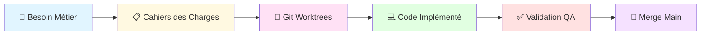
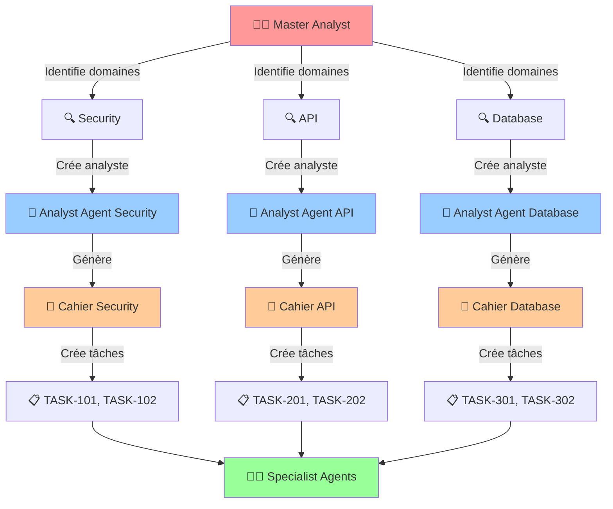
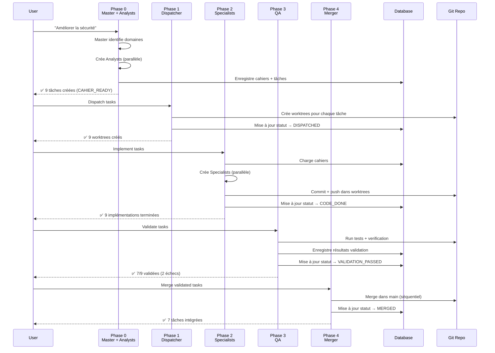
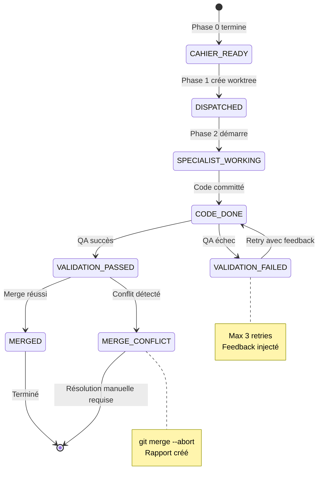
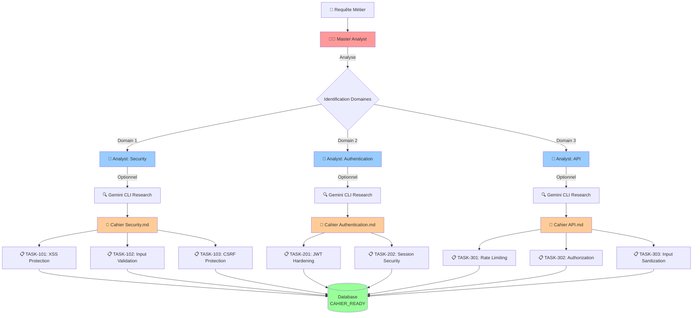
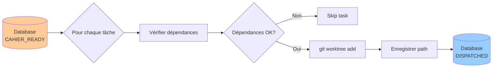
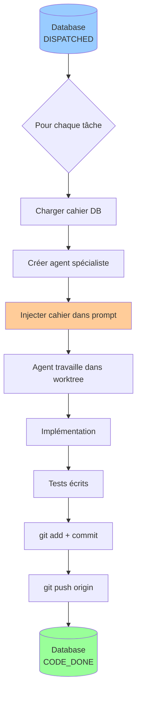
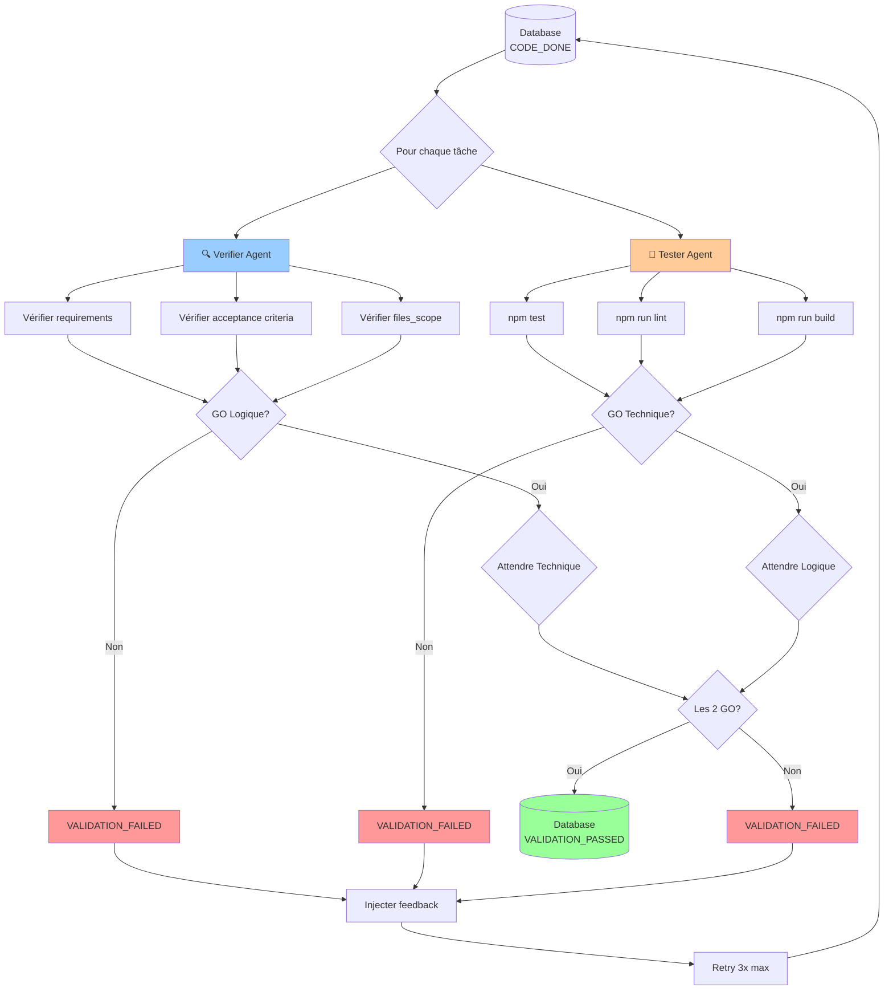
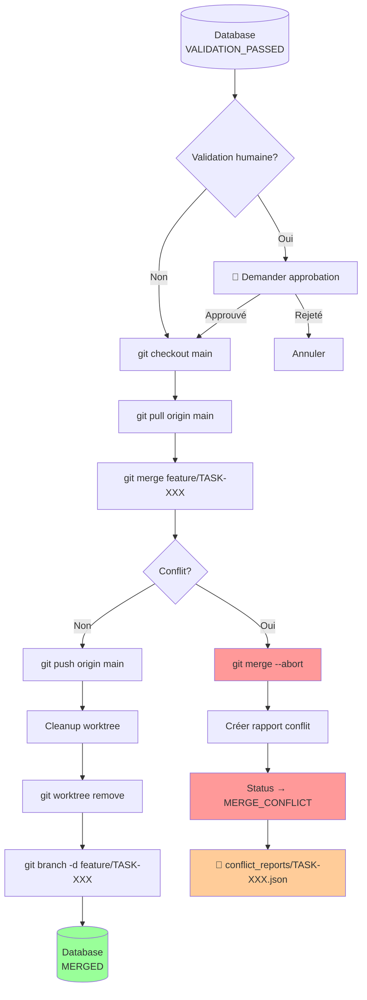
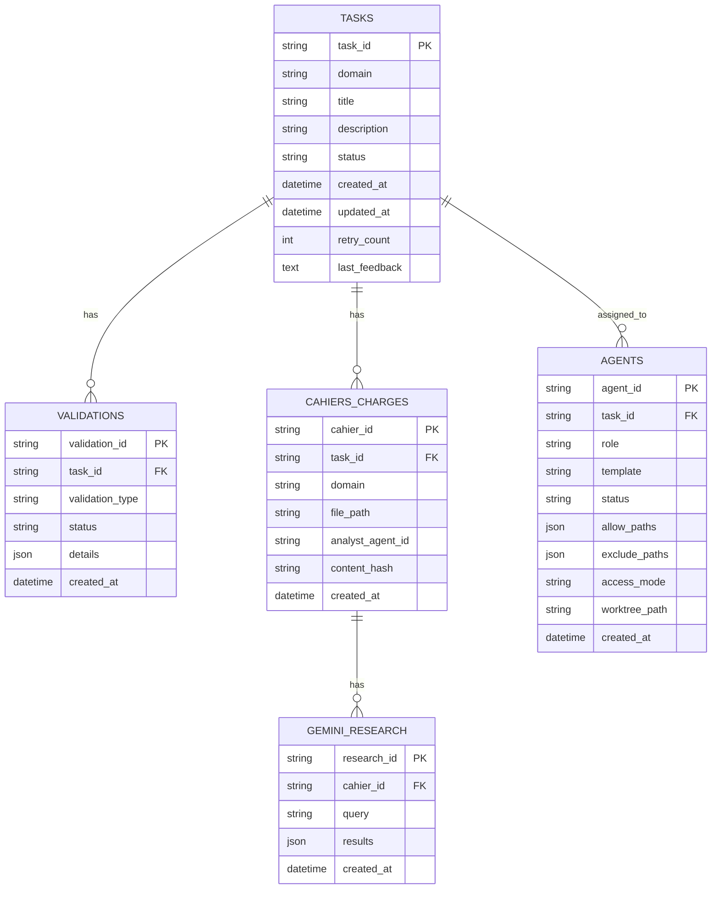

<div align="center">

# 🏗️ Blueprint - Generative Agent Pipeline

**Un système d'orchestration d'agents IA où des agents "Générateurs" créent dynamiquement des agents "Ouvriers" spécialisés pour paralléliser le développement logiciel de bout en bout.**

[](https://github.com/yourusername/blueprint)
[](https://www.python.org/)
[](LICENSE)
[](README.md)

[Documentation](#-documentation) •
[Installation](#-installation) •
[Guide de Démarrage](#-guide-de-démarrage-rapide) •
[Architecture](#-architecture-du-pipeline) •
[Exemples](#-exemples-dutilisation) •
[FAQ](#-faq)

</div>

---

## 📋 Table des Matières

- [Vue d'Ensemble](#-vue-densemble)
- [Principe Fondamental](#-principe-fondamental--architecture-générative)
- [Architecture du Pipeline](#-architecture-du-pipeline)
  - [Phase 0: Master Analyst + Analystes](#phase-0--master-analyst--analystes-cahiers-des-charges)
  - [Phase 1: Dispatcher](#phase-1--dispatcher-création-de-worktrees)
  - [Phase 2: Spécialistes](#phase-2--spécialistes-implémentation-avec-contexte)
  - [Phase 3: QA](#phase-3--qa-validation-parallèle)
  - [Phase 4: Merger](#phase-4--merger-intégration-sécurisée)
- [Installation](#-installation)
- [Guide de Démarrage Rapide](#-guide-de-démarrage-rapide)
- [Configuration](#-configuration)
- [Exemples d'Utilisation](#-exemples-dutilisation)
- [Structure du Projet](#-structure-du-projet)
- [Base de Données](#-base-de-données)
- [Cahiers des Charges](#-cahiers-des-charges)
- [Sécurité](#-sécurité-et-bonnes-pratiques)
- [API Reference](#-api-reference)
- [Nouveautés v2.0](#-nouveautés-v20)
- [Migration depuis v1.x](#-migration-depuis-v1x)
- [Troubleshooting](#-troubleshooting)
- [FAQ](#-faq)
- [Roadmap](#-roadmap)
- [Contributing](#-contributing)
- [License](#-license)

---

## 🎯 Vue d'Ensemble

**Blueprint** est un pipeline d'orchestration d'agents IA qui transforme une requête métier en code production fonctionnel à travers **5 phases entièrement automatisées**.

### 🔄 Flux de Transformation



### ⚡ Pourquoi Blueprint ?

| Problème | Solution Blueprint |
|----------|-------------------|
| 🔴 Tâches complexes → un seul agent surchargé | ✅ Décomposition automatique en domaines spécialisés |
| 🔴 Manque de contexte pour les agents | ✅ Cahiers des charges riches avec recherche externe |
| 🔴 Développement séquentiel lent | ✅ Parallélisation massive avec Git worktrees |
| 🔴 Conflits de code entre agents | ✅ Isolation complète + détection automatique |
| 🔴 Validation manuelle chronophage | ✅ Double validation automatique (logique + technique) |

---

## 💡 Principe Fondamental : Architecture Générative

Le cœur de Blueprint est son **architecture générative** : au lieu d'avoir des agents fixes pré-configurés, le système **crée dynamiquement** des agents spécialisés adaptés à chaque besoin.



### 🎭 Exemple Concret

**Input** : *"Améliorer la sécurité de l'application"*

**Ce qui se passe** :

1. **Master Analyst** analyse et identifie :
   - Domain: `Security` (XSS, CSRF, Input Validation)
   - Domain: `Authentication` (JWT, Session Management)
   - Domain: `API` (Rate Limiting, Authorization)

2. **3 Analyst Agents** sont créés en parallèle, chacun :
   - Effectue une recherche externe (optionnel via Gemini CLI)
   - Génère un **cahier des charges** riche en contexte
   - Crée 2-3 tâches granulaires automatiquement

3. **9 Specialist Agents** (3 domaines × 3 tâches) :
   - Reçoivent le cahier correspondant injecté dans leur prompt
   - Implémentent dans des worktrees isolés
   - Commitent et poussent leur code

4. **Validation parallèle** : Chaque tâche est validée (logique + technique)

5. **Merge séquentiel** : Intégration sécurisée dans `main` avec gestion de conflits

---

## 🏗️ Architecture du Pipeline

### Vue d'Ensemble du Workflow



### Statuts des Tâches



---

## Phase 0 : Master Analyst + Analystes (Cahiers des Charges)

### 🎯 Objectif

Transformer une requête métier globale en **cahiers des charges détaillés** avec tâches granulaires prêtes à implémenter.

### 📥 Input

```
"Améliorer la sécurité de l'application"
```

### ⚙️ Workflow



### 📤 Output

1. **Cahiers des charges** : Fichiers Markdown dans `cahiers_charges/`
2. **Tâches granulaires** : 8 tâches avec statut `CAHIER_READY`
3. **Métadonnées** : Enregistrées en base de données

### 📝 Exemple de Cahier Généré

```markdown
# Cahier des Charges - Security Domain

**Domaine**: Security
**Priorité**: high
**Complexité estimée**: moderate
**Analysé par**: Agent(Analyst-Security-20250102-143022)
**Date**: 2025-01-02

---

## 1. Contexte et Analyse

L'application présente plusieurs vulnérabilités de sécurité identifiées lors de l'audit.
Les vecteurs d'attaque principaux sont :
- Injection XSS via les champs de formulaire
- Manque de validation server-side sur les inputs utilisateur
- Absence de protection CSRF sur les endpoints critiques

## 2. Objectifs du Domaine

- **OBJ-SEC-01** : Implémenter une protection XSS complète sur tous les inputs
- **OBJ-SEC-02** : Ajouter une validation stricte server-side avec whitelist
- **OBJ-SEC-03** : Implémenter des tokens CSRF sur tous les formulaires

## 3. Spécifications Techniques

### Technologies Recommandées
- **Sanitization** : DOMPurify (client), validator.js (serveur)
- **CSRF** : csurf middleware (Express) ou équivalent
- **Validation** : Joi ou Zod pour schema validation

### Architecture
```
src/security/
├── sanitizer.js        # XSS sanitization utilities
├── validator.js        # Input validation schemas
└── csrf-middleware.js  # CSRF token management
```

## 4. Recherche Externe (Gemini CLI)

**Query** : "OWASP Top 10 2023 XSS prevention best practices"

**Résultats** :
- Utiliser Content Security Policy (CSP) headers
- Encoder tous les outputs en fonction du contexte (HTML, JavaScript, CSS)
- Préférer les frameworks avec auto-escaping (React, Vue)
- Implémenter Subresource Integrity (SRI) pour les CDN

*Note: Recherche effectuée via Gemini CLI avec un prompt structuré pour obtenir les best practices actuelles.*

## 5. Tâches Générées

Cette analyse a généré les tâches suivantes :

### TASK-101 : Implémenter XSS Protection
- **Fichiers** : `src/security/sanitizer.js`, `tests/security/sanitizer.test.js`
- **Critères** :
  - Tous les inputs utilisateur sont sanitizés
  - Tests couvrent les cas d'attaque XSS classiques
  - CSP headers configurés

### TASK-102 : Ajouter Input Validation Server-Side
- **Fichiers** : `src/security/validator.js`, `src/middleware/validation.js`
- **Critères** :
  - Schemas Joi/Zod pour chaque endpoint
  - Whitelist validation stricte
  - Messages d'erreur sécurisés (sans leak d'info)

### TASK-103 : Implémenter CSRF Protection
- **Fichiers** : `src/security/csrf-middleware.js`, `src/routes/*.js`
- **Critères** :
  - Tokens CSRF sur tous les POST/PUT/DELETE
  - Token rotation après authentication
  - Tests d'intégration anti-CSRF

## 6. Dépendances

- TASK-101 doit être terminée avant TASK-102 (sanitization avant validation)
- TASK-103 est indépendante

## 7. Critères d'Acceptation Globaux

- ✅ Scan OWASP ZAP ne détecte aucune vulnérabilité XSS
- ✅ Tests de validation rejettent les inputs malformés
- ✅ Attaques CSRF échouent avec 403 Forbidden

## 8. Ressources

- [OWASP XSS Prevention Cheat Sheet](https://cheatsheetseries.owasp.org/cheatsheets/XSS_Prevention_Cheat_Sheet.html)
- [OWASP CSRF Prevention](https://cheatsheetseries.owasp.org/cheatsheets/Cross-Site_Request_Forgery_Prevention_Cheat_Sheet.html)
- [Content Security Policy Guide](https://developer.mozilla.org/en-US/docs/Web/HTTP/CSP)
```

### 🔧 Configuration

```yaml
phase0:
  enabled: true
  max_parallel_analysts: 5  # Nombre d'analystes en parallèle

  # Recherche externe optionnelle via Gemini CLI
  enable_gemini_research: false  # Désactivé par défaut
  gemini_model: "gemini-2.5-pro"  # Modèle utilisé par Gemini CLI

  # Stockage des cahiers
  cahiers_charges_dir: "cahiers_charges"

  # Templates d'analystes par domaine
  analyst_templates:
    security: "security-auditor"
    authentication: "security-auditor"
    api: "senior-engineer"
    database: "database-expert"
    frontend: "ui-ux-designer"
```

---

## Phase 1 : Dispatcher (Création de Worktrees)

### 🎯 Objectif

Créer des **environnements Git isolés** (worktrees) pour chaque tâche afin de permettre le développement parallèle sans conflits.

### 📥 Input

Tâches avec statut `CAHIER_READY` (générées par Phase 0)

### ⚙️ Workflow



### 💻 Commandes Git Exécutées

Pour **chaque** tâche (ex: TASK-101) :

```bash
# 1. Créer une branche depuis main
git checkout main
git pull origin main

# 2. Créer le worktree isolé
git worktree add -b feature/TASK-101 .worktrees/TASK-101

# 3. Le worktree est prêt
# Arborescence créée :
# .worktrees/
# └── TASK-101/  ← Copie complète du repo sur branche feature/TASK-101
```

### 📁 Structure Créée

```
.worktrees/
├── TASK-101/          # Worktree pour tâche 101
│   ├── src/
│   ├── tests/
│   └── .git           # Lié au repo principal
├── TASK-102/          # Worktree pour tâche 102
└── TASK-201/          # Worktree pour tâche 201
```

### ✅ Avantages des Worktrees

| Avantage | Description |
|----------|-------------|
| 🔒 **Isolation complète** | Chaque agent travaille sur sa propre branche |
| ⚡ **Parallélisation** | Plusieurs agents développent simultanément |
| 🛡️ **Pas de conflits** | Impossible d'écraser le code d'un autre agent |
| 🔄 **Facilité de merge** | Chaque branche merge indépendamment |

### 🔧 Configuration

```yaml
phase1:
  enabled: true
  worktrees_dir: ".worktrees"  # Dossier des worktrees

  # Vérification des dépendances
  check_dependencies: true

  # Format des IDs de tâche
  task_id_format: "TASK-{counter:03d}"
  task_id_start: 101
```

---

## Phase 2 : Spécialistes (Implémentation avec Contexte)

### 🎯 Objectif

Implémenter le code de chaque tâche en injectant le **cahier des charges complet** comme contexte dans le prompt de l'agent.

### 📥 Input

- Tâches avec statut `DISPATCHED`
- Worktrees Git créés
- Cahiers des charges en base de données

### ⚙️ Workflow



### 🔬 Injection de Contexte

L'**AgentFactory** enrichit le prompt de base avec le cahier complet :

```python
# Template de base (ex: senior-engineer)
base_prompt = """
You are a senior software engineer.
Implement the following task...
"""

# Cahier chargé depuis DB
cahier_content = db.load_cahier_content(task_id)

# Prompt enrichi
enriched_prompt = f"""
{base_prompt}

---

## CAHIER DES CHARGES (Specification Document)

The following cahier des charges has been created by an analyst agent.
Follow its recommendations for architecture, technologies, and best practices.

{cahier_content}

---

**Task ID**: {task_id}
**Worktree**: .worktrees/{task_id}/
**Branch**: feature/{task_id}

Begin implementation following the cahier's specifications.
"""
```

### 📊 Comparaison Avant/Après

| Élément | Sans Cahier (v1.x) | Avec Cahier (v2.0) |
|---------|-------------------|-------------------|
| **Contexte** | Spec JSON simple | Cahier Markdown riche |
| **Recherche** | Aucune | Gemini CLI optionnel |
| **Recommandations** | Basiques | Best practices, architecture |
| **Qualité code** | Moyenne | Élevée (suit les recommandations) |

### 💻 Exemple de Worktree après Implémentation

```
.worktrees/TASK-101/
├── src/
│   └── security/
│       ├── sanitizer.js       ← Nouveau fichier
│       └── index.js
├── tests/
│   └── security/
│       └── sanitizer.test.js  ← Nouveau test
└── .git
    └── COMMIT_EDITMSG         ← "feat: implement XSS sanitizer"
```

### 🔧 Configuration

```yaml
phase2:
  enabled: true
  max_parallel_specialists: 3  # Nombre de spécialistes en parallèle

  # Template par défaut
  specialist_template: "senior-engineer"

  # Injection des cahiers (clé de la v2.0)
  inject_cahier_as_context: true

  # Qualité du code
  auto_format: true
  auto_lint: false
```

---

## Phase 3 : QA (Validation Parallèle)

### 🎯 Objectif

Double validation **parallèle** : logique (spec compliance) ET technique (tests).

> **Note v2.0**: Les agents verifier et tester sont maintenant créés automatiquement lors de l'exécution de Phase 3 s'ils n'existent pas. Ils sont configurés avec un accès en lecture complet au worktree et utilisent le mode `log` (audit) au lieu de `block`.

### 📥 Input

Tâches avec statut `CODE_DONE`

### ⚙️ Workflow



### 🔍 A. Vérificateur (Validation Logique)

**Question** : *"Le code respecte-t-il la spec ?"*

**Vérifie** :

1. ✅ **Requirements** : Tous les objectifs implémentés ?
2. ✅ **Acceptance Criteria** : Tous les critères validés ?
3. ✅ **Files Scope** : Seulement les fichiers autorisés modifiés ?

**Output** :

```json
{
  "validation_type": "logic",
  "status": "pass",
  "coverage": 1.0,
  "details": {
    "requirements_met": ["REQ-1", "REQ-2", "REQ-3"],
    "requirements_missing": [],
    "criteria_validated": ["CRI-1", "CRI-2"],
    "files_out_of_scope": []
  }
}
```

### 🧪 B. Testeur (Validation Technique)

**Question** : *"Le code fonctionne-t-il techniquement ?"*

**Exécute** :

```bash
# Dans le worktree de la tâche
cd .worktrees/TASK-101

# 1. Tests unitaires
npm test

# 2. Linting
npm run lint

# 3. Build (si applicable)
npm run build
```

**Output** :

```json
{
  "validation_type": "tech",
  "status": "fail",
  "details": {
    "tests": {
      "total": 12,
      "passed": 11,
      "failed": 1,
      "failures": [
        {
          "test": "should reject XSS in nested objects",
          "error": "Expected 'sanitized' but got 'unsanitized'"
        }
      ]
    },
    "lint": {
      "status": "pass",
      "warnings": 2
    },
    "build": {
      "status": "pass"
    }
  }
}
```

### 🔄 Boucle de Retry avec Feedback

Si la validation échoue, le système **réessaie automatiquement** (max 3 fois) en injectant le feedback :

```
=== RETRY ATTEMPT 2/3 ===

Previous validation failed with 2 issues:

Logic Validation:
  ❌ Requirement "Must handle null values" NOT MET

Technical Validation:
  ❌ Test "should reject XSS in nested objects" FAILED
     Expected: 'sanitized'
     Actual: 'unsanitized'

Please fix these specific issues and retry.
```

### 🔧 Configuration

```yaml
phase3:
  enabled: true
  parallel_execution: true  # Verifier ET Tester en parallèle

  # Vérificateur
  verifier:
    enabled: true
    strict_mode: true
    check_files_scope: true

  # Testeur
  tester:
    enabled: true
    auto_run_tests: true
    test_commands:
      - "npm test"
      - "npm run lint"
    create_issues_on_failure: true  # Crée GitHub Issue si échec
```

---

## Phase 4 : Merger (Intégration Sécurisée)

### 🎯 Objectif

Intégrer les tâches validées dans `main` avec **gestion sécurisée des conflits**.

### 📥 Input

Tâches avec statut `VALIDATION_PASSED`

### ⚙️ Workflow



### 🛡️ Gestion Sécurisée des Conflits

**IMPORTANT** : Blueprint **N'AUTO-RÉSOUT JAMAIS** les conflits pour éviter l'écrasement de code.

#### Comportement en Cas de Conflit

```bash
# 1. Tentative de merge
git merge feature/TASK-101

# 2. Conflit détecté
# CONFLICT (content): Merge conflict in src/security/sanitizer.js

# 3. ABORT IMMÉDIAT (sécurité)
git merge --abort

# 4. Repo main reste PROPRE (aucun état de merge incomplet)
```

#### Rapport de Conflit Généré

```json
{
  "task_id": "TASK-101",
  "branch": "feature/TASK-101",
  "timestamp": "2025-01-02T15:30:22Z",
  "conflicting_files": [
    "src/security/sanitizer.js",
    "tests/security/sanitizer.test.js"
  ],
  "resolution_instructions": [
    "1. git checkout feature/TASK-101",
    "2. git rebase main",
    "3. Résoudre les conflits manuellement dans les fichiers listés",
    "4. git add <fichiers résolus>",
    "5. git rebase --continue",
    "6. git push origin feature/TASK-101 --force-with-lease",
    "7. Relancer Phase 4 pour merger"
  ],
  "base_commit": "a1b2c3d",
  "feature_commit": "e4f5g6h",
  "conflicting_changes": {
    "src/security/sanitizer.js": {
      "base_lines": "15-23",
      "feature_lines": "15-28",
      "description": "Both branches modified the sanitize() function"
    }
  }
}
```

### ✅ Garanties de Sécurité

| Garantie | Mécanisme |
|----------|-----------|
| 🛡️ **Repo toujours propre** | `git merge --abort` automatique |
| 📋 **Traçabilité complète** | Rapport détaillé dans `conflict_reports/` |
| 🚫 **Aucune auto-résolution** | Fonctionnalité supprimée volontairement |
| 👤 **Validation humaine** | Option `require_human_validation` |
| 🔒 **Merge séquentiel** | Une tâche à la fois |

### 🔧 Configuration

```yaml
phase4:
  enabled: true

  # Validation humaine recommandée
  require_human_validation: true

  # Merge settings
  auto_merge: false  # Requiert require_human_validation: false
  cleanup_after_merge: true  # Supprime worktree + branche après succès

  # Gestion de conflits (SÉCURISÉE)
  on_conflict: "prompt_user"  # Résolution manuelle OBLIGATOIRE
  create_conflict_report: true

  # Batch merging (optionnel)
  batch_merge_enabled: false
  max_batch_size: 5
```

---

## 📦 Installation

### Prérequis

| Logiciel | Version Minimale | Vérification |
|----------|------------------|--------------|
| Python | 3.9+ | `python --version` |
| Git | 2.20+ | `git --version` |
| Node.js | 14+ (optionnel) | `node --version` |
| WSL | 2 (Windows uniquement) | `wsl --status` |

### Étape 1 : Cloner le Projet

```bash
# Cloner le repository
git clone https://github.com/yourusername/blueprint.git
cd blueprint

# Vérifier que vous êtes sur main
git checkout main
```

### Étape 2 : Installer les Dépendances Python

```bash
# Créer un environnement virtuel (recommandé)
python -m venv venv

# Activer l'environnement
# Windows
venv\Scripts\activate
# Linux/Mac
source venv/bin/activate

# Installer les dépendances
pip install -r requirements.txt
```

### Étape 3 : Configuration Gemini CLI (Optionnel)

Pour activer la recherche externe avec Gemini CLI :

**Installation** :
```bash
# Option A : Installation globale
npm install -g @google/gemini-cli

# Option B : Utilisation via npx (sans installation)
# Vérifier que npx est disponible
npx --version
```

**Authentification** :
```bash
# Option 1 : OAuth Login (Recommandé)
gemini auth login  # ou npx @google/gemini-cli auth login

# Option 2 : API Key (Variable d'environnement)
# Windows
set GEMINI_API_KEY="votre-clé-api"
# Linux/Mac
export GEMINI_API_KEY="votre-clé-api"
```

**Test** :
```bash
# Windows
npx.cmd @google/gemini-cli "Test" --output-format json

# Linux/Mac
npx @google/gemini-cli "Test" --output-format json
```

📚 Voir [`docs/GEMINI_CLI_SETUP.md`](docs/GEMINI_CLI_SETUP.md) pour plus de détails.

### Étape 4 : Initialiser la Base de Données

```bash
# Créer pipeline.db et les tables
python orchestrator/main.py init
```

**Output attendu** :
```
✅ Database initialized: pipeline.db
✅ Git helper initialized for: C:\Users\...\Blueprint
✅ Pipeline initialized successfully
```

### Étape 5 : Vérifier l'Installation

```bash
# Afficher le statut
python orchestrator/main.py status
```

**Output attendu** :
```
=== Pipeline Status ===
Tasks:
  - CAHIER_READY: 0
  - DISPATCHED: 0
  - CODE_DONE: 0
  - VALIDATION_PASSED: 0
  - MERGED: 0

Agents created: 0
```

---

## 🚀 Guide de Démarrage Rapide

### Exemple Complet : "Améliorer la Sécurité"

#### 1️⃣ Lancer le Pipeline Complet

```bash
python orchestrator/main.py start "Améliorer la sécurité de l'application"
```

**Ce qui se passe** :

```
=== PHASE 0: Master Analyst + Analystes ===
🧑‍💼 Master Analyst analyse la requête...
✅ Domaines identifiés: Security, Authentication, API

📝 Création de 3 analystes en parallèle...
✅ Analyst(Security) → Cahier créé → 3 tâches générées
✅ Analyst(Authentication) → Cahier créé → 2 tâches générées
✅ Analyst(API) → Cahier créé → 3 tâches générées

📊 Phase 0 terminée: 8 tâches créées (CAHIER_READY)

=== PHASE 1: Dispatcher ===
🌳 Création de worktrees pour 8 tâches...
✅ TASK-101 → .worktrees/TASK-101 (branch: feature/TASK-101)
✅ TASK-102 → .worktrees/TASK-102 (branch: feature/TASK-102)
...

📊 Phase 1 terminée: 8 tâches dispatched

=== PHASE 2: Spécialistes ===
👨‍💻 Création de 3 spécialistes en parallèle...
✅ Specialist(TASK-101) → Code implémenté + committé
✅ Specialist(TASK-102) → Code implémenté + committé
...

📊 Phase 2 terminée: 8 tâches implémentées

=== PHASE 3: QA ===
🔍 Validation de 8 tâches...
✅ TASK-101 → VALIDATION_PASSED
⚠️  TASK-102 → VALIDATION_FAILED (retry avec feedback)
✅ TASK-102 → VALIDATION_PASSED (retry 1/3)
...

📊 Phase 3 terminée: 7/8 validées (1 échec définitif)

=== PHASE 4: Merger ===
🔀 Merge de 7 tâches validées...
✅ TASK-101 → MERGED
✅ TASK-103 → MERGED
⚠️  TASK-201 → MERGE_CONFLICT (rapport créé)
...

📊 Phase 4 terminée: 6/7 mergées (1 conflit)

=== PIPELINE COMPLETE ===
✅ 6 tâches intégrées dans main
⚠️  1 conflit nécessite résolution manuelle
❌ 1 échec de validation permanent
```

#### 2️⃣ Ou Lancer Phase par Phase

```bash
# Phase 0 : Génération des cahiers
python orchestrator/main.py run-phase 0 --requirement "Améliorer la sécurité"

# Vérifier les cahiers générés
ls cahiers_charges/Security/

# Phase 1 : Création des worktrees
python orchestrator/main.py run-phase 1

# Vérifier les worktrees
git worktree list

# Phase 2 : Implémentation
python orchestrator/main.py run-phase 2

# Phase 3 : Validation
python orchestrator/main.py run-phase 3

# Phase 4 : Merge
python orchestrator/main.py run-phase 4
```

---

## ⚙️ Configuration

Le fichier [config/pipeline_config.yaml](config/pipeline_config.yaml) contrôle tous les aspects du pipeline.

### Configuration de Base

```yaml
# Général
general:
  project_name: "Generative Agent Pipeline"
  log_level: "INFO"  # DEBUG, INFO, WARNING, ERROR
  log_file: "logs/pipeline.log"

# Base de données
database:
  path: "pipeline.db"
  backup_enabled: true

# Git
git:
  base_branch: "main"
  worktrees_dir: ".worktrees"
  merge_strategy: "recursive"
  conflict_resolution: "manual"  # IMPORTANT: toujours manuel
```

### Configuration des Phases

```yaml
# Phase 0: Analystes
phase0:
  enabled: true
  max_parallel_analysts: 5
  enable_gemini_research: false  # Optionnel
  cahiers_charges_dir: "cahiers_charges"

# Phase 1: Dispatcher
phase1:
  enabled: true
  check_dependencies: true

# Phase 2: Spécialistes
phase2:
  enabled: true
  max_parallel_specialists: 3
  inject_cahier_as_context: true  # Clé de la v2.0

# Phase 3: QA
phase3:
  enabled: true
  parallel_execution: true  # Verifier + Tester en //

# Phase 4: Merger
phase4:
  enabled: true
  require_human_validation: true  # Recommandé
  on_conflict: "prompt_user"
  create_conflict_report: true
```

### Configuration Gemini CLI (Optionnel)

Blueprint utilise Gemini CLI pour enrichir les cahiers des charges avec des recherches externes sur les best practices, la sécurité et la documentation.

**1. Installation de Gemini CLI** :

```bash
# Option A : Installation globale
npm install -g @google/gemini-cli

# Option B : Utilisation via npx (sans installation)
npx @google/gemini-cli --version
```

**2. Authentification** :

```bash
# Option 1 : OAuth Login (Recommandé)
gemini auth login  # ou npx @google/gemini-cli auth login

# Option 2 : API Key (Variable d'environnement)
export GEMINI_API_KEY="votre-clé-api"
```

**3. Configuration dans pipeline_config.yaml** :

```yaml
gemini:
  use_cli: true  # Utilise Gemini CLI
  enabled: false  # Mettre à true pour activer
  cli_model: "gemini-2.5-pro"  # ou "gemini-2.5-flash" pour plus rapide
  cli_timeout: 30  # Timeout en secondes
  cache_results: false  # Cache optionnel

phase0:
  enable_gemini_research: true  # Active la recherche pour les analystes
  gemini_model: "gemini-2.5-pro"
```

**Test de fonctionnement** :

```bash
# Windows
npx.cmd @google/gemini-cli "Hello" --output-format json

# Linux/WSL
npx @google/gemini-cli "Hello" --output-format json
```

📚 **Documentation complète** : Voir [`docs/GEMINI_CLI_SETUP.md`](docs/GEMINI_CLI_SETUP.md)

### Configuration Avancée

#### Gestion d'Erreurs

```yaml
error_handling:
  max_retries: 3
  retry_delay: 10  # secondes
  enable_retry_loop: true  # Boucle de correction
  inject_feedback: true  # Feedback détaillé aux agents

  on_validation_failure:
    action: "retry"  # retry, skip, abort
    max_attempts: 3
```

#### Sécurité

```yaml
security:
  validate_file_paths: true
  allowed_file_extensions:
    - ".js"
    - ".ts"
    - ".py"

  protect_branches:
    - "main"
    - "master"
    - "production"

  # Access Control (granular)
  access_control:
    enabled: true
    mode: "block"  # block, log, ask
    sensitive_paths:
      - "**/.env"
      - "**/.env.*"
      - "**/secrets.json"
```

---

## 📖 Exemples d'Utilisation

### Exemple 1 : Feature Complète

```bash
# Requête
python orchestrator/main.py start "Ajouter un système de notifications par email"

# Résultat
# Phase 0 : Master identifie → Email, Queue, Templates
# Phase 0 : 3 Analysts → 9 tâches créées
# Phase 1-4 : Pipeline complet
# Output : 9 features mergées dans main
```

### Exemple 2 : Refactoring de Code

```bash
python orchestrator/main.py start "Refactoriser le module d'authentification pour utiliser TypeScript"

# Résultat
# Phase 0 : Master identifie → TypeScript Migration, Auth Module
# Phase 0 : 2 Analysts → 6 tâches créées
# ...
```

### Exemple 3 : Correction de Bugs

```bash
python orchestrator/main.py start "Corriger le bug de fuite mémoire dans le système de cache"

# Résultat
# Phase 0 : Master identifie → Caching, Performance
# Phase 0 : 2 Analysts → 4 tâches créées
# ...
```

### Exemple 4 : Lancer seulement Phase 0 pour Planification

```bash
# Générer seulement les cahiers (pas d'implémentation)
python orchestrator/main.py run-phase 0 --requirement "Migrer vers React 18"

# Inspecter les cahiers générés
cat cahiers_charges/Frontend/rapport_analyse.md
cat cahiers_charges/Frontend/TASK-101_cahier.md

# Décider manuellement si continuer
python orchestrator/main.py run-phase 1  # Si satisfait
```

---

## 📂 Structure du Projet

```
Blueprint/
│
├── 📁 config/                          # Configuration
│   ├── pipeline_config.yaml            # Config principale ⚙️
│   ├── spec_schema.json                # Schéma JSON specs (legacy)
│   └── template_sources.yaml           # Sources templates agents
│
├── 📁 cahiers_charges/                 # Cahiers des charges (v2.0) ✨
│   ├── index.json                      # Index global
│   ├── Security/
│   │   ├── rapport_analyse.md          # Rapport domaine Security
│   │   ├── TASK-101_cahier.md          # Cahier XSS Protection
│   │   └── TASK-102_cahier.md          # Cahier Input Validation
│   ├── Authentication/
│   │   └── rapport_analyse.md
│   └── API/
│       └── rapport_analyse.md
│
├── 📁 .worktrees/                      # Git worktrees (Phase 1)
│   ├── TASK-101/                       # Worktree isolé pour tâche 101
│   ├── TASK-102/
│   └── TASK-201/
│
├── 📁 conflict_reports/                # Rapports de conflits Git
│   ├── TASK-201_conflict.json
│   └── TASK-305_conflict.json
│
├── 📁 orchestrator/                    # Code principal 🎼
│   │
│   ├── main.py                         # Point d'entrée CLI
│   ├── db.py                           # Gestion SQLite
│   ├── agent_factory.py                # Création agents + injection cahiers
│   │
│   ├── 📁 agents/
│   │   └── gemini_researcher.py        # Recherche externe via Gemini CLI
│   │
│   ├── 📁 phases/
│   │   ├── phase0_master_analysts.py   # Phase 0: Master + Analystes
│   │   ├── phase1_dispatcher.py        # Phase 1: Dispatcher
│   │   ├── phase2_specialists.py       # Phase 2: Spécialistes
│   │   ├── phase3_qa.py                # Phase 3: QA
│   │   └── phase4_merger.py            # Phase 4: Merger
│   │
│   └── 📁 utils/
│       ├── git_helper.py               # Opérations Git/Worktrees
│       ├── logger.py                   # Logging centralisé
│       ├── access_control.py           # Contrôle d'accès fichiers
│       ├── template_downloader.py      # Téléchargement templates GitHub
│       └── template_converter.py       # Conversion templates
│
├── 📁 logs/                            # Logs du pipeline
│   ├── pipeline.log                    # Log principal
│   └── access_violations.log           # Violations access control
│
├── 📁 docs/                            # Documentation technique
│   ├── REFACTORING_PROGRESS.md
│   ├── IMPLEMENTATION_SUMMARY.md
│   └── FINAL_STATUS.md
│
├── pipeline.db                         # Base de données SQLite 🗄️
├── requirements.txt                    # Dépendances Python
├── README.md                           # Ce fichier
└── .gitignore
```

---

## 🗄️ Base de Données

Blueprint utilise **SQLite** (`pipeline.db`) pour tracker l'état complet du pipeline.

### Schéma de la Base de Données



### Tables Principales

#### 1. `tasks`

Toutes les tâches du pipeline.

```sql
CREATE TABLE tasks (
    task_id TEXT PRIMARY KEY,
    domain TEXT,
    title TEXT,
    description TEXT,
    status TEXT,  -- CAHIER_READY, DISPATCHED, CODE_DONE, etc.
    spec_json TEXT,
    worktree_path TEXT,
    branch_name TEXT,
    created_at TIMESTAMP,
    updated_at TIMESTAMP,
    retry_count INTEGER DEFAULT 0,
    last_feedback TEXT
);
```

**Statuts possibles** :
- `CAHIER_READY` : Cahier créé, prêt pour dispatch
- `DISPATCHED` : Worktree créé
- `SPECIALIST_WORKING` : Spécialiste en cours
- `CODE_DONE` : Code implémenté
- `VALIDATION_PASSED` : Validations OK
- `VALIDATION_FAILED` : Validations KO (retry)
- `MERGED` : Intégré dans main
- `MERGE_CONFLICT` : Conflit détecté

#### 2. `cahiers_charges`

Cahiers des charges générés par les analystes.

```sql
CREATE TABLE cahiers_charges (
    cahier_id TEXT PRIMARY KEY,
    task_id TEXT,
    domain TEXT,
    file_path TEXT,  -- cahiers_charges/Security/TASK-101_cahier.md
    analyst_agent_id TEXT,
    content_hash TEXT,
    created_at TIMESTAMP,
    FOREIGN KEY (task_id) REFERENCES tasks(task_id)
);
```

#### 3. `gemini_research`

Résultats de recherche externe (optionnel).

```sql
CREATE TABLE gemini_research (
    research_id TEXT PRIMARY KEY,
    cahier_id TEXT,
    query TEXT,
    results TEXT,  -- JSON
    created_at TIMESTAMP,
    FOREIGN KEY (cahier_id) REFERENCES cahiers_charges(cahier_id)
);
```

#### 4. `validations`

Résultats des validations (Phase 3).

```sql
CREATE TABLE validations (
    validation_id TEXT PRIMARY KEY,
    task_id TEXT,
    validation_type TEXT,  -- logic, tech
    status TEXT,  -- pass, fail
    details TEXT,  -- JSON
    created_at TIMESTAMP,
    FOREIGN KEY (task_id) REFERENCES tasks(task_id)
);
```

#### 5. `agents`

Tous les agents créés par le pipeline.

```sql
CREATE TABLE agents (
    agent_id TEXT PRIMARY KEY,
    task_id TEXT,
    role TEXT,  -- analyst, specialist, verifier, tester
    template TEXT,
    status TEXT,
    allow_paths TEXT,  -- JSON array of allowed file/directory patterns
    exclude_paths TEXT,  -- JSON array of excluded file/directory patterns
    access_mode TEXT,  -- 'block', 'log', 'ask' - access control enforcement mode
    worktree_path TEXT,  -- Path to agent's worktree for validation context
    created_at TIMESTAMP,
    FOREIGN KEY (task_id) REFERENCES tasks(task_id)
);
```

### Requêtes Utiles

```sql
-- Nombre de tâches par statut
SELECT status, COUNT(*) FROM tasks GROUP BY status;

-- Tâches avec conflits
SELECT task_id, domain, title FROM tasks WHERE status = 'MERGE_CONFLICT';

-- Taux de succès des validations
SELECT
    validation_type,
    COUNT(*) as total,
    SUM(CASE WHEN status = 'pass' THEN 1 ELSE 0 END) as passed
FROM validations
GROUP BY validation_type;

-- Cahiers avec recherche Gemini
SELECT c.domain, c.file_path, g.query
FROM cahiers_charges c
JOIN gemini_research g ON c.cahier_id = g.cahier_id;
```

---

## 📄 Cahiers des Charges

Les **cahiers des charges** sont le cœur de la v2.0. Ce sont des documents Markdown riches en contexte créés par les analyst agents.

### Structure d'un Cahier

```markdown
# Cahier des Charges - [DOMAIN]

**Domaine**: [Domain Name]
**Priorité**: high | medium | low
**Complexité estimée**: simple | moderate | complex
**Analysé par**: Agent([Agent-ID])
**Date**: [ISO Date]

---

## 1. Contexte et Analyse

[Analyse approfondie du contexte du domaine]

## 2. Objectifs du Domaine

- **OBJ-XXX-01** : [Objectif 1]
- **OBJ-XXX-02** : [Objectif 2]

## 3. Spécifications Techniques

### Technologies Recommandées
[Bibliothèques, frameworks, outils]

### Architecture
[Structure de code proposée]

## 4. Recherche Externe (Gemini)

**Query** : "[Query envoyée à Gemini]"

**Résultats** :
[Résultats de la recherche]

## 5. Tâches Générées

Cette analyse a généré les tâches suivantes :

### TASK-XXX : [Title]
- **Fichiers** : [List of files]
- **Critères** : [Acceptance criteria]

## 6. Dépendances

[Liste des dépendances entre tâches]

## 7. Critères d'Acceptation Globaux

- ✅ [Critère 1]
- ✅ [Critère 2]

## 8. Ressources

- [External links, documentation]
```

### Exemple Réel

Voir [Phase 0](#phase-0--master-analyst--analystes-cahiers-des-charges) pour un exemple complet de cahier généré.

### Organisation des Fichiers

```
cahiers_charges/
├── index.json                    # Index global de tous les cahiers
├── Security/
│   ├── rapport_analyse.md        # Rapport global du domaine
│   ├── TASK-101_cahier.md        # Cahier spécifique à TASK-101
│   ├── TASK-102_cahier.md        # Cahier spécifique à TASK-102
│   └── TASK-103_cahier.md
├── Authentication/
│   ├── rapport_analyse.md
│   ├── TASK-201_cahier.md
│   └── TASK-202_cahier.md
└── API/
    ├── rapport_analyse.md
    ├── TASK-301_cahier.md
    ├── TASK-302_cahier.md
    └── TASK-303_cahier.md
```

### Avantages des Cahiers

| Avantage | Description |
|----------|-------------|
| 📚 **Contexte riche** | Documentation complète du domaine |
| 🔍 **Recherche externe** | Best practices via Gemini CLI |
| 🎯 **Spécialisation** | Chaque specialist reçoit son cahier |
| 📖 **Documentation** | Cahiers = documentation technique intégrée |
| 🔄 **Traçabilité** | Stockés en base + fichiers Markdown |

---

## 🛡️ Sécurité et Bonnes Pratiques

### 1. Validation Humaine Obligatoire

**CRITIQUE** : Toujours activer la validation humaine avant merge :

```yaml
phase4:
  require_human_validation: true
```

**Pourquoi** : Évite qu'un agent ne merge du code incorrect/dangereux automatiquement.

### 2. Isolation Git Complète

Chaque tâche travaille dans un **worktree isolé** :

```bash
.worktrees/
├── TASK-101/  # Agent 1
├── TASK-102/  # Agent 2
└── TASK-103/  # Agent 3
```

**Avantages** :
- ✅ Pas de conflit pendant le développement
- ✅ Branches dédiées par tâche
- ✅ Cleanup automatique après merge

### 3. Gestion Sécurisée des Conflits

```yaml
phase4:
  on_conflict: "prompt_user"  # ⚠️ TOUJOURS résolution manuelle
  create_conflict_report: true
```

**Garanties** :
- ❌ AUCUNE auto-résolution (évite écrasement de code)
- ✅ `git merge --abort` automatique
- ✅ Repo main toujours propre
- ✅ Rapport détaillé généré

### 4. Contrôle d'Accès Fichiers (Intégré v2.0)

```yaml
security:
  access_control:
    enabled: true
    mode: "block"  # Bloque les accès non autorisés

    # Fichiers sensibles (toujours bloqués)
    sensitive_paths:
      - "**/.env"
      - "**/.env.*"
      - "**/secrets.json"
      - "**/credentials.json"
```

**Nouveauté v2.0**: L'access control est maintenant **stocké en base de données** pour chaque agent créé. Le système merge automatiquement les restrictions depuis:
1. Le template de l'agent
2. La spécification de la tâche
3. Les defaults du pipeline
4. Les sensitive_paths (toujours exclus)

**Modes d'accès**:
- `block`: Strict enforcement (utilisé pour analysts et specialists)
- `log`: Audit only (utilisé pour QA agents)
- `ask`: Demande validation humaine

### 5. Retry Loop Sécurisée

```yaml
error_handling:
  enable_retry_loop: true
  max_retries: 3  # ⚠️ Limite obligatoire (évite boucles infinies)
  inject_feedback: true
```

### 6. Branches Protégées

```yaml
security:
  protect_branches:
    - "main"
    - "master"
    - "production"
```

**Blueprint refuse de** :
- Pousser directement sur ces branches
- Auto-merger sans validation
- Supprimer ces branches

---

## 🔧 API Reference

### CLI Commands

```bash
# Initialiser le pipeline
python orchestrator/main.py init

# Lancer le pipeline complet
python orchestrator/main.py start "<requirement>"

# Lancer une phase spécifique
python orchestrator/main.py run-phase <0-4> [--requirement "<req>"]

# Afficher le statut
python orchestrator/main.py status

# Réinitialiser (supprimer la DB)
python orchestrator/main.py reset
```

### Database API

```python
from orchestrator.db import Database

# Initialiser
db = Database("pipeline.db")
await db.initialize()

# Créer une tâche
task_id = await db.create_task(
    domain="Security",
    title="Implement XSS protection",
    description="...",
    spec={"requirements": [...]}
)

# Créer un cahier
cahier_id = await db.create_cahier(
    task_id=task_id,
    domain="Security",
    file_path="cahiers_charges/Security/TASK-101_cahier.md",
    analyst_agent_id="agent-123"
)

# Mettre à jour le statut
await db.update_task_status(task_id, "DISPATCHED")

# Charger le contenu d'un cahier
cahier_content = await db.load_cahier_content(task_id)

# Créer un agent avec access control (v2.0)
agent_id = await db.create_agent(
    agent_id="specialist-TASK-101-abc123",
    task_id="TASK-101",
    role="specialist",
    template_name="senior-engineer",
    allow_paths=["src/**/*.js", "tests/**/*.test.js"],
    exclude_paths=[".git/**", "*.db", "**/.env"],
    access_mode="block",  # 'block', 'log', or 'ask'
    worktree_path=".worktrees/TASK-101"
)

# Statistiques
stats = await db.get_stats()
```

### Agent Factory API

```python
from orchestrator.agent_factory import AgentFactory

factory = AgentFactory(config)

# Créer un prompt enrichi avec cahier
prompt = factory.create_agent_prompt(
    template_name="senior-engineer",
    context={
        "task_id": "TASK-101",
        "worktree_path": ".worktrees/TASK-101",
        "branch_name": "feature/TASK-101"
    },
    cahier_content=cahier_markdown  # Injecté automatiquement
)

# Injection manuelle de cahier
enriched = factory.inject_cahier_context(
    base_prompt=base_prompt,
    cahier_content=cahier_content,
    task_id="TASK-101"
)

# Obtenir la config d'accès merged (v2.0)
merged_access = factory.get_merged_access_config(
    template_name='senior-engineer',
    spec={'access': {'allow': ['src/**/*.js']}}
)
# Returns: {
#   'allow': ['src/**/*.js'],
#   'exclude': ['.git/**', '*.db', '**/.env', ...]  # Inclut defaults + sensitive
# }
```

---

## 🆕 Nouveautés v2.0

### 🎨 Architecture Cahiers des Charges

**Avant (v1.x)** : Specs JSON simples
**Après (v2.0)** : Cahiers Markdown riches avec recherche externe

**Bénéfices** :
- ✅ Contexte 10x plus riche pour les spécialistes
- ✅ Documentation intégrée au code
- ✅ Meilleure qualité d'implémentation

### 🔄 Boucle de Correction Automatique

**Nouveau** : Retry loop avec feedback injecté

```
VALIDATION_FAILED → Feedback détaillé → CODE_DONE (retry 1/3)
```

**Bénéfices** :
- ✅ Auto-correction des erreurs simples
- ✅ Limite de 3 retries (évite boucles infinies)
- ✅ Feedback précis injecté au codeur

### 🛡️ Sécurisation Merge

**Supprimé** : `auto_resolve_conflicts` (dangereux)
**Ajouté** : `git merge --abort` automatique

**Bénéfices** :
- ✅ Repo main toujours propre
- ✅ Aucun risque d'écrasement de code
- ✅ Rapports de conflits détaillés

### 📊 Nouveaux Statuts

- `CAHIER_READY` : Cahier créé, prêt pour dispatch
- `SPECIALIST_WORKING` : Implémentation en cours
- `MERGE_CONFLICT` : Conflit détecté (résolution manuelle)

### 🔢 Tracking Amélioré

Nouvelles colonnes DB :
- `retry_count` : Nombre de tentatives
- `last_feedback` : Dernier feedback de validation

### 🔐 Access Control Intégré

**Nouveau**: Access control stocké en base de données

**Avant (v1.x)**: Access control seulement dans les prompts (suggestion)
**Après (v2.0)**: Access control stocké en DB, trackable, auditable

**Bénéfices**:
- ✅ Traçabilité complète des restrictions par agent
- ✅ Merge automatique des configs (template + spec + defaults)
- ✅ Prêt pour enforcement programmatique futur
- ✅ Agents QA créés automatiquement avec restrictions appropriées

**Nouvelles colonnes dans `agents`**:
- `allow_paths` : JSON array des patterns autorisés
- `exclude_paths` : JSON array des patterns exclus
- `access_mode` : Mode d'enforcement ('block', 'log', 'ask')
- `worktree_path` : Chemin du worktree pour validation contexte

---

## 🔄 Migration depuis v1.x

Si vous utilisez une version `< 2.0.0` :

### Étape 1 : Sauvegarder

```bash
# Sauvegarder l'ancienne DB
cp pipeline.db pipeline.db.v1.backup

# Sauvegarder les specs (si précieuses)
cp -r specs/ specs.v1.backup/
```

### Étape 2 : Réinitialiser

```bash
# Supprimer l'ancienne DB
rm pipeline.db

# Créer la nouvelle DB avec les nouvelles tables
python orchestrator/main.py init
```

### Étape 3 : Mettre à jour la Config

```yaml
# config/pipeline_config.yaml

# AJOUTER ces sections
phase0:
  enabled: true
  max_parallel_analysts: 5
  enable_gemini_research: false
  cahiers_charges_dir: "cahiers_charges"

phase2:
  inject_cahier_as_context: true

phase4:  # Ancien phase5
  on_conflict: "prompt_user"
  create_conflict_report: true
```

### Étape 4 : Tester

```bash
# Test Phase 0 seule
python orchestrator/main.py run-phase 0 --requirement "Test migration"

# Vérifier les cahiers générés
ls cahiers_charges/

# Tester le pipeline complet
python orchestrator/main.py start "Test complet v2.0"
```

### Changements Majeurs

| v1.x | v2.0 | Impact |
|------|------|--------|
| 6 phases | 5 phases | Phase 0 consolidée |
| Specs JSON | Cahiers Markdown | Format plus riche |
| Phase 4 (QA) | Phase 3 (QA) | Renumérotation |
| Phase 5 (Merger) | Phase 4 (Merger) | Renumérotation |
| Auto-résolution conflits | Supprimée | Plus sécurisé |
| Pas de retry | Retry loop (3x) | Auto-correction |
| Gemini API | Gemini CLI | Plus flexible, pas de gestion de clés |

**⚠️ IMPORTANT** : Les tâches en cours dans v1.x seront perdues. Terminez-les avant migration.

---

## 🔍 Troubleshooting

### Erreur : "Not a git repository"

**Symptôme** :
```
fatal: not a git repository (or any of the parent directories): .git
```

**Solution** :
```bash
# Initialiser Git
git init

# Créer un commit initial
git add .
git commit -m "Initial commit"
```

---

### Erreur : "Agent template not found in WSL"

**Symptôme** :
```
FileNotFoundError: Template 'senior-engineer' not found in ~/.claude/agents/
```

**Solution** :
```bash
# Vérifier que WSL est démarré
wsl --status

# Vérifier l'existence des templates
wsl ls ~/.claude/agents/

# Si le dossier n'existe pas, créer les templates
wsl mkdir -p ~/.claude/agents/
# Puis copier vos templates dans ce dossier
```

---

### Erreur : "Database locked"

**Symptôme** :
```
sqlite3.OperationalError: database is locked
```

**Solution** :
```bash
# Une autre instance du pipeline tourne
# Trouver le processus
ps aux | grep "python.*main.py"

# Tuer le processus
kill <PID>

# Ou attendre qu'il se termine
```

---

### Erreur : "Worktree already exists"

**Symptôme** :
```
fatal: '.worktrees/TASK-101' already exists
```

**Solution** :
```bash
# Lister les worktrees
git worktree list

# Supprimer le worktree
git worktree remove .worktrees/TASK-101

# Ou forcer la suppression
git worktree remove --force .worktrees/TASK-101
```

---

### Problème : Phase 3 échoue toujours

**Symptôme** : Toutes les validations échouent

**Solutions** :

1. **Vérifier les test commands** :
```yaml
phase3:
  tester:
    test_commands:
      - "npm test"  # ⚠️ Vérifier que cette commande existe
      - "npm run lint"
```

2. **Désactiver temporairement** :
```yaml
phase3:
  verifier:
    enabled: false  # Désactiver verifier
  tester:
    enabled: true   # Garder seulement tester
```

3. **Mode debug** :
```yaml
general:
  log_level: "DEBUG"  # Logs détaillés
development:
  verbose_logging: true
```

---

### Problème : Conflits Git fréquents

**Symptôme** : Beaucoup de `MERGE_CONFLICT`

**Solutions** :

1. **Merge plus fréquent** : Ne pas accumuler trop de tâches avant merge

2. **Vérifier les dépendances** :
```json
{
  "task_id": "TASK-202",
  "dependencies": ["TASK-201"]  // Dépendance explicite
}
```

3. **Désactiver batch merge** :
```yaml
phase4:
  batch_merge_enabled: false  # Merge une par une
```

---

## ❓ FAQ

### Q1 : Puis-je utiliser Blueprint en production ?

**R** : ⚠️ **Pas encore**. La version actuelle utilise des **simulations** (`_simulate_*()` functions). Pour la production :
1. Remplacer les simulations par de vrais appels IA (ex: Anthropic API)
2. Tester extensivement sur des projets réels
3. Implémenter le monitoring et les alertes

---

### Q2 : Combien de tâches le pipeline peut-il gérer en parallèle ?

**R** : Cela dépend de votre configuration :

```yaml
phase0:
  max_parallel_analysts: 5  # 5 analystes simultanés

phase2:
  max_parallel_specialists: 3  # 3 spécialistes simultanés

phase3:
  parallel_execution: true  # Verifier + Tester en //
```

**Exemple** : Avec `max_parallel_specialists: 3`, si vous avez 9 tâches :
- Batch 1 : TASK-101, TASK-102, TASK-103 (parallèle)
- Batch 2 : TASK-201, TASK-202, TASK-203 (parallèle)
- Batch 3 : TASK-301, TASK-302, TASK-303 (parallèle)

---

### Q3 : Que se passe-t-il si un agent échoue ?

**R** : Dépend de la phase et de la configuration :

**Phase 0-2** : L'agent échoue, la tâche reste dans son statut actuel
**Phase 3** : Boucle de retry (max 3 fois) avec feedback injecté
**Phase 4** : Si conflit → `git merge --abort`, rapport créé

```yaml
error_handling:
  max_retries: 3
  on_validation_failure:
    action: "retry"  # ou "skip", "abort"
```

---

### Q4 : Puis-je ajouter mes propres templates d'agents ?

**R** : ✅ **Oui** !

1. Créer le template dans WSL :
```bash
wsl nano ~/.claude/agents/custom-agent.md
```

2. Ajouter dans la config :
```yaml
agents:
  role_mapping:
    custom_role: "custom-agent"
```

3. Utiliser :
```yaml
phase2:
  specialist_template: "custom-agent"
```

---

### Q5 : Comment désactiver Gemini Research ?

**R** : Par défaut, Gemini CLI est désactivé. La configuration :

```yaml
phase0:
  enable_gemini_research: false  # Déjà false par défaut

gemini:
  enabled: false  # Déjà false par défaut
  use_cli: true  # Utilise Gemini CLI au lieu de l'API
```

**Note** : Gemini CLI doit être configuré séparément. Voir [`docs/GEMINI_CLI_SETUP.md`](docs/GEMINI_CLI_SETUP.md) pour l'installation et l'authentification.

---

### Q6 : Puis-je utiliser un autre modèle que Gemini pour la recherche ?

**R** : Gemini CLI supporte plusieurs modèles :
- `gemini-2.5-pro` : Plus puissant, contexte 1M tokens
- `gemini-2.5-flash` : Plus rapide pour les requêtes simples

Pour utiliser un autre outil CLI (ex: Claude, GPT-4) :

1. Créer `orchestrator/agents/custom_researcher.py`
2. Implémenter la même interface que `GeminiResearcher`
3. Adapter la méthode `_call_cli()` pour votre outil CLI
4. Modifier `phase0_master_analysts.py` pour utiliser votre classe

---

### Q7 : Quelle est la différence entre "analyst" et "specialist" ?

| Analyst (Phase 0) | Specialist (Phase 2) |
|-------------------|---------------------|
| 📋 Crée des cahiers des charges | 💻 Implémente le code |
| 🔍 Effectue de la recherche | 🎯 Suit les recommandations du cahier |
| 🧠 Vision macro (domaine) | 🔬 Vision micro (tâche) |
| **Output** : Markdown | **Output** : Code |

---

### Q8 : Comment gérer les secrets (API keys) ?

**R** : ✅ **Variables d'environnement** (recommandé) :

```bash
# .env (ne PAS commit)
GEMINI_API_KEY="votre-clé"

# Charger dans le code
import os
api_key = os.getenv("GEMINI_API_KEY")
```

❌ **Ne JAMAIS** mettre les clés directement dans `pipeline_config.yaml` si vous commitez ce fichier.

---

### Q9 : Puis-je utiliser Blueprint avec d'autres langages que JavaScript/Python ?

**R** : ✅ **Oui** ! Blueprint est agnostique du langage. Configurez simplement :

```yaml
phase3:
  tester:
    test_commands:
      - "cargo test"        # Rust
      - "go test ./..."     # Go
      - "mvn test"          # Java
      - "dotnet test"       # C#
```

---

### Q10 : Combien de temps prend une exécution complète du pipeline ?

**R** : Dépend de :
- Nombre de domaines identifiés
- Nombre de tâches par domaine
- Parallélisation configurée
- Complexité du code

**Exemple** : Requête "Améliorer la sécurité"
- Phase 0 : ~5 min (3 domaines, 9 tâches)
- Phase 1 : ~1 min (créer 9 worktrees)
- Phase 2 : ~15 min (3 spécialistes en //, 3 batches)
- Phase 3 : ~10 min (validations parallèles)
- Phase 4 : ~5 min (merge séquentiel)
- **Total** : ~36 min

---

## 🗺️ Roadmap

### v2.1 (Q1 2025)

- [ ] **Intégration Anthropic API** : Remplacer simulations par vrais appels Claude
- [ ] **Interface Web de Monitoring** : Dashboard temps réel du pipeline
- [ ] **Metrics & Analytics** : Tracking performance, taux de succès

### v2.2 (Q2 2025)

- [ ] **Multi-repos Support** : Gérer plusieurs repos simultanément
- [ ] **GitHub Actions CI/CD** : Intégration continue
- [ ] **Auto-rollback** : Rollback automatique si merge échoue en prod

### v3.0 (Q3 2025)

- [ ] **Claude Code CLI Integration** : Utiliser subagents natifs `.claude/agents/`
- [ ] **Template Marketplace** : Partager des templates d'agents
- [ ] **Distributed Execution** : Pipeline distribué sur plusieurs machines

### Backlog

- [ ] Tests unitaires complets (pytest)
- [ ] Support multi-langages (TypeScript, Go, Rust)
- [ ] Plugin system pour extensibilité
- [ ] Webhooks pour notifications externes
- [ ] Code review automatique avec Claude

---

## 🤝 Contributing

Blueprint est un projet **expérimental** d'architecture générative d'agents. Les contributions sont bienvenues !

### Comment Contribuer

1. **Fork** le projet
2. **Créer une branche** : `git checkout -b feature/amazing-feature`
3. **Commit** : `git commit -m "feat: add amazing feature"`
4. **Push** : `git push origin feature/amazing-feature`
5. **Ouvrir une Pull Request**

### Domaines de Contribution

- 🧠 **Amélioration des prompts** : Rendre les agents plus efficaces
- 📝 **Nouveaux templates** : Ajouter des spécialités (DevOps, ML, etc.)
- ⚡ **Optimisation** : Améliorer la parallélisation
- 🛡️ **Sécurité** : Renforcer la gestion de conflits et access control
- 📚 **Documentation** : Améliorer ce README, ajouter des guides

### Code Style

- Python : PEP 8
- Docstrings : Google style
- Type hints obligatoires
- Tests pour toute nouvelle feature

---

## 📜 License

**Educational & Research Use Only**

Ce projet est fourni "tel quel" à des fins **éducatives et de recherche**. Il s'agit d'un système expérimental d'orchestration d'agents IA.

⚠️ **Limitations** :
- Pas de garantie de fonctionnement en production
- Simulations uniquement (pas de vrais appels IA)
- Utiliser à vos propres risques

Pour une utilisation commerciale ou en production, contactez l'auteur.

---

## 👤 Auteur

**Système d'Architecture Générative d'Agents**

📧 Contact : [votre-email]
🐙 GitHub : [votre-github]

---

## 🙏 Remerciements

- **Anthropic** : Pour Claude et le Claude Code CLI
- **Google** : Pour Gemini API
- **La communauté open-source** : Pour les outils et bibliothèques utilisés

---

<div align="center">

**⭐ Si ce projet vous est utile, n'hésitez pas à lui donner une étoile ! ⭐**

[](https://github.com/yourusername/blueprint)

---

**Blueprint v2.0** - *Transformez vos idées en code, automatiquement.*

</div>
