<div align="center">

# 🏗️ Blueprint - Generative Agent Pipeline

**Un système d'orchestration d'agents IA où des agents "Générateurs" créent dynamiquement des agents "Ouvriers" spécialisés pour paralléliser le développement logiciel de bout en bout.**

[](https://github.com/yourusername/blueprint)
[](https://www.python.org/)
[](LICENSE)
[](README.md)

[Documentation](#-documentation) •
[Installation](#-installation) •
[Guide de Démarrage](#-guide-de-démarrage-rapide) •
[Architecture](#-architecture-du-pipeline) •
[Exemples](#-exemples-dutilisation) •
[FAQ](#-faq)

</div>

---

## 📋 Table des Matières

- [Vue d'Ensemble](#-vue-densemble)
- [Principe Fondamental](#-principe-fondamental--architecture-générative)
- [Architecture du Pipeline](#-architecture-du-pipeline)
  - [Phase 0: Master Analyst + Analystes](#phase-0--master-analyst--analystes-cahiers-des-charges)
  - [Phase 0.5: Enrichissement Gemini](#phase-05--enrichissement-gemini-optionnel)
  - [Phase 1: Dispatcher](#phase-1--dispatcher-création-de-worktrees)
  - [Phase 2: Spécialistes](#phase-2--spécialistes-implémentation-avec-contexte)
  - [Phase 3: QA](#phase-3--qa-validation-parallèle)
  - [Phase 4: Merger](#phase-4--merger-intégration-sécurisée)
- [Installation](#-installation)
- [Guide de Démarrage Rapide](#-guide-de-démarrage-rapide)
- [Travailler avec des Projets Externes](#-travailler-avec-des-projets-externes)
- [Nettoyage et Maintenance](#-nettoyage-et-maintenance)
- [Configuration](#-configuration)
- [Exemples d'Utilisation](#-exemples-dutilisation)
- [Structure du Projet](#-structure-du-projet)
- [Base de Données](#-base-de-données)
- [Cahiers des Charges](#-cahiers-des-charges)
- [Sécurité](#-sécurité-et-bonnes-pratiques)
- [API Reference](#-api-reference)
- [Nouveautés v2.0](#-nouveautés-v20)
- [Migration depuis v1.x](#-migration-depuis-v1x)
- [Troubleshooting](#-troubleshooting)
- [FAQ](#-faq)
- [Roadmap](#-roadmap)
- [Contributing](#-contributing)
- [License](#-license)

---

## 🎯 Vue d'Ensemble

**Blueprint** est un pipeline d'orchestration d'agents IA qui transforme une requête métier en code production fonctionnel à travers **5 phases entièrement automatisées**.

### 🔄 Flux de Transformation

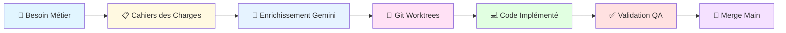
```mermaid
graph LR
    A[💼 Besoin Métier] --> B[📋 Cahiers des Charges]
    B --> B2[🌟 Enrichissement Gemini]
    B2 --> C[🌳 Git Worktrees]
    C --> D[💻 Code Implémenté]
    D --> E[✅ Validation QA]
    E --> F[🔀 Merge Main]

    style A fill:#e1f5ff
    style B fill:#fff9e1
    style B2 fill:#e6f3ff
    style C fill:#ffe1f5
    style D fill:#e1ffe1
    style E fill:#ffe1e1
    style F fill:#f5e1ff
```

### ⚡ Pourquoi Blueprint ?

| Problème | Solution Blueprint |
|----------|-------------------|
| 🔴 Tâches complexes → un seul agent surchargé | ✅ Décomposition automatique en domaines spécialisés |
| 🔴 Manque de contexte pour les agents | ✅ Cahiers des charges riches avec recherche externe |
| 🔴 Développement séquentiel lent | ✅ Parallélisation massive avec Git worktrees |
| 🔴 Conflits de code entre agents | ✅ Isolation complète + détection automatique |
| 🔴 Validation manuelle chronophage | ✅ Double validation automatique (logique + technique) |

### 🎯 Blueprint comme Orchestrateur

**Blueprint** fonctionne comme un **orchestrateur externe** qui peut travailler sur n'importe quel projet Git :

| Répertoire | Rôle | Contenu |
|------------|------|---------|
| **Blueprint/** | 🎼 Orchestrateur | Base de données, cahiers des charges, configuration, logs |
| **Votre Projet/** | 🎯 Cible | Code source, worktrees, branches de features |

**Séparation des responsabilités** :
- ✅ Blueprint reste propre et réutilisable
- ✅ Votre projet reçoit uniquement le code généré
- ✅ Pas de pollution : cahiers des charges dans Blueprint, code dans votre projet

---

## 💡 Principe Fondamental : Architecture Générative

Le cœur de Blueprint est son **architecture générative** : au lieu d'avoir des agents fixes pré-configurés, le système **crée dynamiquement** des agents spécialisés adaptés à chaque besoin.

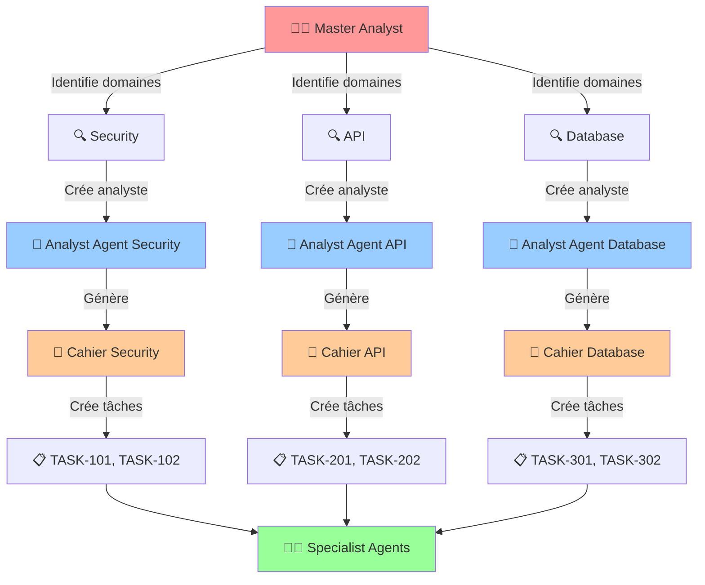
```mermaid
graph TD
    A[🧑‍💼 Master Analyst] -->|Identifie domaines| B[🔍 Security]
    A -->|Identifie domaines| C[🔍 API]
    A -->|Identifie domaines| D[🔍 Database]

    B -->|Crée analyste| E[📝 Analyst Agent Security]
    C -->|Crée analyste| F[📝 Analyst Agent API]
    D -->|Crée analyste| G[📝 Analyst Agent Database]

    E -->|Génère| H[📄 Cahier Security]
    F -->|Génère| I[📄 Cahier API]
    G -->|Génère| J[📄 Cahier Database]

    H -->|Crée tâches| K[📋 TASK-101, TASK-102]
    I -->|Crée tâches| L[📋 TASK-201, TASK-202]
    J -->|Crée tâches| M[📋 TASK-301, TASK-302]

    K --> N[👨‍💻 Specialist Agents]
    L --> N
    M --> N

    style A fill:#ff9999
    style E fill:#99ccff
    style F fill:#99ccff
    style G fill:#99ccff
    style H fill:#ffcc99
    style I fill:#ffcc99
    style J fill:#ffcc99
    style N fill:#99ff99
```

### 🎭 Exemple Concret

**Input** : *"Améliorer la sécurité de l'application"*

**Ce qui se passe** :

1. **Master Analyst** analyse et identifie :
   - Domain: `Security` (XSS, CSRF, Input Validation)
   - Domain: `Authentication` (JWT, Session Management)
   - Domain: `API` (Rate Limiting, Authorization)

2. **3 Analyst Agents** sont créés en parallèle, chacun :
   - Effectue une recherche externe (optionnel via Gemini CLI)
   - Génère un **cahier des charges** riche en contexte
   - Crée 2-3 tâches granulaires automatiquement

3. **9 Specialist Agents** (3 domaines × 3 tâches) :
   - Reçoivent le cahier correspondant injecté dans leur prompt
   - Implémentent dans des worktrees isolés
   - Commitent et poussent leur code

4. **Validation parallèle** : Chaque tâche est validée (logique + technique)

5. **Merge séquentiel** : Intégration sécurisée dans `main` avec gestion de conflits

---

## 🏗️ Architecture du Pipeline

### Vue d'Ensemble du Workflow

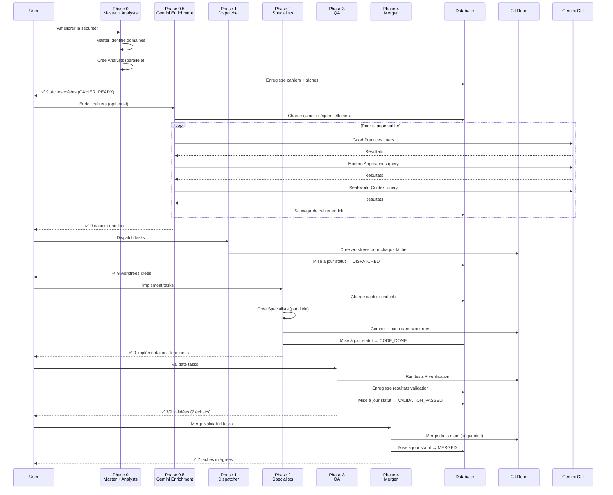
```mermaid
sequenceDiagram
    participant User
    participant Phase0 as Phase 0<br/>Master + Analysts
    participant Phase05 as Phase 0.5<br/>Gemini Enrichment
    participant Phase1 as Phase 1<br/>Dispatcher
    participant Phase2 as Phase 2<br/>Specialists
    participant Phase3 as Phase 3<br/>QA
    participant Phase4 as Phase 4<br/>Merger
    participant DB as Database
    participant Git as Git Repo
    participant Gemini as Gemini CLI

    User->>Phase0: "Améliorer la sécurité"
    Phase0->>Phase0: Master identifie domaines
    Phase0->>Phase0: Crée Analysts (parallèle)
    Phase0->>DB: Enregistre cahiers + tâches
    Phase0-->>User: ✅ 9 tâches créées (CAHIER_READY)

    User->>Phase05: Enrich cahiers (optionnel)
    Phase05->>DB: Charge cahiers séquentiellement
    loop Pour chaque cahier
        Phase05->>Gemini: Good Practices query
        Gemini-->>Phase05: Résultats
        Phase05->>Gemini: Modern Approaches query
        Gemini-->>Phase05: Résultats
        Phase05->>Gemini: Real-world Context query
        Gemini-->>Phase05: Résultats
        Phase05->>DB: Sauvegarde cahier enrichi
    end
    Phase05-->>User: ✅ 9 cahiers enrichis

    User->>Phase1: Dispatch tasks
    Phase1->>Git: Crée worktrees pour chaque tâche
    Phase1->>DB: Mise à jour statut → DISPATCHED
    Phase1-->>User: ✅ 9 worktrees créés

    User->>Phase2: Implement tasks
    Phase2->>DB: Charge cahiers enrichis
    Phase2->>Phase2: Crée Specialists (parallèle)
    Phase2->>Git: Commit + push dans worktrees
    Phase2->>DB: Mise à jour statut → CODE_DONE
    Phase2-->>User: ✅ 9 implémentations terminées

    User->>Phase3: Validate tasks
    Phase3->>Git: Run tests + verification
    Phase3->>DB: Enregistre résultats validation
    Phase3->>DB: Mise à jour statut → VALIDATION_PASSED
    Phase3-->>User: ✅ 7/9 validées (2 échecs)

    User->>Phase4: Merge validated tasks
    Phase4->>Git: Merge dans main (séquentiel)
    Phase4->>DB: Mise à jour statut → MERGED
    Phase4-->>User: ✅ 7 tâches intégrées
```

### Statuts des Tâches

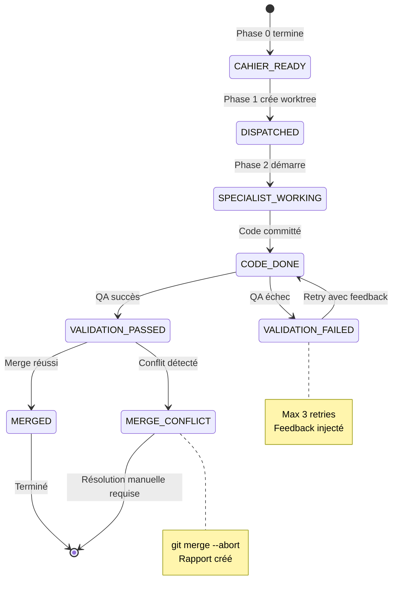
```mermaid
stateDiagram-v2
    [*] --> CAHIER_READY: Phase 0 termine
    CAHIER_READY --> DISPATCHED: Phase 1 crée worktree
    DISPATCHED --> SPECIALIST_WORKING: Phase 2 démarre
    SPECIALIST_WORKING --> CODE_DONE: Code committé
    CODE_DONE --> VALIDATION_PASSED: QA succès
    CODE_DONE --> VALIDATION_FAILED: QA échec
    VALIDATION_FAILED --> CODE_DONE: Retry avec feedback
    VALIDATION_PASSED --> MERGED: Merge réussi
    VALIDATION_PASSED --> MERGE_CONFLICT: Conflit détecté
    MERGE_CONFLICT --> [*]: Résolution manuelle requise
    MERGED --> [*]: Terminé

    note right of VALIDATION_FAILED
        Max 3 retries
        Feedback injecté
    end note

    note right of MERGE_CONFLICT
        git merge --abort
        Rapport créé
    end note
```

---

## Phase 0 : Master Analyst + Analystes (Cahiers des Charges)

### 🎯 Objectif

Transformer une requête métier globale en **cahiers des charges détaillés** avec tâches granulaires prêtes à implémenter.

### 📥 Input

```
"Améliorer la sécurité de l'application"
```

### ⚙️ Workflow

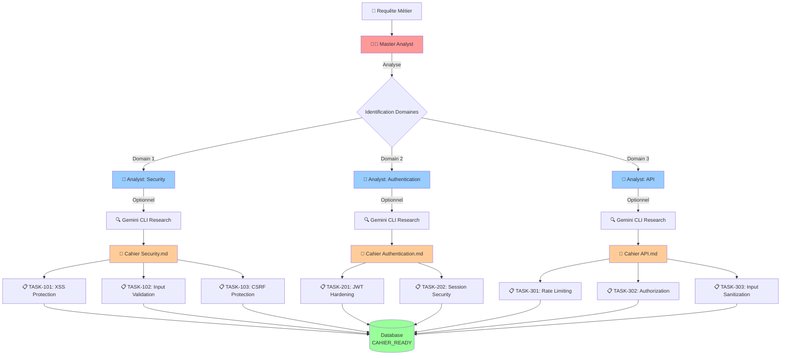
```mermaid
graph TD
    A[💼 Requête Métier] --> B[🧑‍💼 Master Analyst]
    B -->|Analyse| C{Identification Domaines}
    C -->|Domain 1| D[📝 Analyst: Security]
    C -->|Domain 2| E[📝 Analyst: Authentication]
    C -->|Domain 3| F[📝 Analyst: API]

    D -->|Optionnel| D1[🔍 Gemini CLI Research]
    E -->|Optionnel| E1[🔍 Gemini CLI Research]
    F -->|Optionnel| F1[🔍 Gemini CLI Research]

    D1 --> D2[📄 Cahier Security.md]
    E1 --> E2[📄 Cahier Authentication.md]
    F1 --> F2[📄 Cahier API.md]

    D2 --> D3[📋 TASK-101: XSS Protection]
    D2 --> D4[📋 TASK-102: Input Validation]
    D2 --> D5[📋 TASK-103: CSRF Protection]

    E2 --> E3[📋 TASK-201: JWT Hardening]
    E2 --> E4[📋 TASK-202: Session Security]

    F2 --> F3[📋 TASK-301: Rate Limiting]
    F2 --> F4[📋 TASK-302: Authorization]
    F2 --> F5[📋 TASK-303: Input Sanitization]

    D3 --> G[(Database<br/>CAHIER_READY)]
    D4 --> G
    D5 --> G
    E3 --> G
    E4 --> G
    F3 --> G
    F4 --> G
    F5 --> G

    style B fill:#ff9999
    style D fill:#99ccff
    style E fill:#99ccff
    style F fill:#99ccff
    style D2 fill:#ffcc99
    style E2 fill:#ffcc99
    style F2 fill:#ffcc99
    style G fill:#99ff99
```

### 📤 Output

1. **Cahiers des charges** : Fichiers Markdown dans `cahiers_charges/`
2. **Tâches granulaires** : 8 tâches avec statut `CAHIER_READY`
3. **Métadonnées** : Enregistrées en base de données

### 📝 Exemple de Cahier des Charges Généré

```markdown
# Cahier des Charges - Security Domain

**Domaine**: Security
**Priorité**: high
**Complexité estimée**: moderate
**Analysé par**: Agent(Analyst-Security-20250102-143022)
**Date**: 2025-01-02

---

## 1. Contexte et Analyse

L'application présente plusieurs vulnérabilités de sécurité identifiées lors de l'audit.
Les vecteurs d'attaque principaux sont :
- Injection XSS via les champs de formulaire
- Manque de validation server-side sur les inputs utilisateur
- Absence de protection CSRF sur les endpoints critiques

## 2. Objectifs du Domaine

- **OBJ-SEC-01** : Implémenter une protection XSS complète sur tous les inputs
- **OBJ-SEC-02** : Ajouter une validation stricte server-side avec whitelist
- **OBJ-SEC-03** : Implémenter des tokens CSRF sur tous les formulaires

## 3. Spécifications Techniques

### Technologies Recommandées
- **Sanitization** : DOMPurify (client), validator.js (serveur)
- **CSRF** : csurf middleware (Express) ou équivalent
- **Validation** : Joi ou Zod pour schema validation

### Architecture

```
src/security/
├── sanitizer.js        # XSS sanitization utilities
├── validator.js        # Input validation schemas
└── csrf-middleware.js  # CSRF token management
```

## 4. Recherche Externe (Gemini CLI)

**Query** : "OWASP Top 10 2023 XSS prevention best practices"

**Résultats** :
- Utiliser Content Security Policy (CSP) headers
- Encoder tous les outputs en fonction du contexte (HTML, JavaScript, CSS)
- Préférer les frameworks avec auto-escaping (React, Vue)
- Implémenter Subresource Integrity (SRI) pour les CDN

*Note: Recherche effectuée via Gemini CLI avec un prompt structuré pour obtenir les best practices actuelles.*

## 5. Tâches Générées

Cette analyse a généré les tâches suivantes :

### TASK-101 : Implémenter XSS Protection
- **Fichiers** : `src/security/sanitizer.js`, `tests/security/sanitizer.test.js`
- **Critères** :
  - Tous les inputs utilisateur sont sanitizés
  - Tests couvrent les cas d'attaque XSS classiques
  - CSP headers configurés

### TASK-102 : Ajouter Input Validation Server-Side
- **Fichiers** : `src/security/validator.js`, `src/middleware/validation.js`
- **Critères** :
  - Schemas Joi/Zod pour chaque endpoint
  - Whitelist validation stricte
  - Messages d'erreur sécurisés (sans leak d'info)

### TASK-103 : Implémenter CSRF Protection
- **Fichiers** : `src/security/csrf-middleware.js`, `src/routes/*.js`
- **Critères** :
  - Tokens CSRF sur tous les POST/PUT/DELETE
  - Token rotation après authentication
  - Tests d'intégration anti-CSRF

## 6. Dépendances

- TASK-101 doit être terminée avant TASK-102 (sanitization avant validation)
- TASK-103 est indépendante

## 7. Critères d'Acceptation Globaux

- ✅ Scan OWASP ZAP ne détecte aucune vulnérabilité XSS
- ✅ Tests de validation rejettent les inputs malformés
- ✅ Attaques CSRF échouent avec 403 Forbidden

## 8. Ressources

- [OWASP XSS Prevention Cheat Sheet](https://cheatsheetseries.owasp.org/cheatsheets/XSS_Prevention_Cheat_Sheet.html)
- [OWASP CSRF Prevention](https://cheatsheetseries.owasp.org/cheatsheets/Cross-Site_Request_Forgery_Prevention_Cheat_Sheet.html)
- [Content Security Policy Guide](https://developer.mozilla.org/en-US/docs/Web/HTTP/CSP)

## 9. Restrictions d'Accès Agent

### Dossiers et Fichiers Autorisés
- `src/security/**` : Lecture et écriture complète
- `tests/security/**` : Lecture et écriture complète
- `docs/security/**` : Lecture et écriture pour documentation

### Dossiers et Fichiers Interdits
- `.env*` : Fichiers de configuration sensibles
- `**/.git/**` : Dossier Git
- `*.db` : Fichiers de base de données
- `secrets.json` : Fichiers de secrets
- `config/production/**` : Configuration de production
```

### 🔧 Configuration

```yaml
phase0:
  enabled: true
  max_parallel_analysts: 5  # Nombre d'analystes en parallèle

  # Recherche externe optionnelle via Gemini CLI
  enable_gemini_research: false  # Désactivé par défaut
  gemini_model: "gemini-2.5-pro"  # Modèle utilisé par Gemini CLI

  # Stockage des cahiers
  cahiers_charges_dir: "cahiers_charges"

  # Templates d'analystes par domaine
  analyst_templates:
    security: "security-auditor"
    authentication: "security-auditor"
    api: "senior-engineer"
    database: "database-expert"
    frontend: "ui-ux-designer"
```

---

## Phase 0.5 : Enrichissement Gemini (Optionnel)

### 🎯 Objectif

Enrichir séquentiellement les cahiers des charges générés avec des **bonnes pratiques actuelles**, des **approches modernes** et du **contexte du monde réel** via Gemini CLI.

### 📥 Input

Cahiers des charges générés par Phase 0 (statut `CAHIER_READY`)

### ⚙️ Workflow

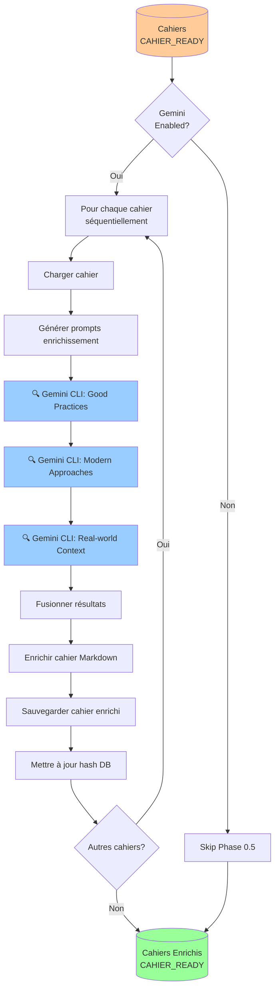
```mermaid
graph TD
    A[(Cahiers<br/>CAHIER_READY)] --> B{Gemini<br/>Enabled?}
    B -->|Non| Z[Skip Phase 0.5]
    B -->|Oui| C[Pour chaque cahier<br/>séquentiellement]

    C --> D[Charger cahier]
    D --> E[Générer prompts enrichissement]
    E --> F[🔍 Gemini CLI: Good Practices]
    F --> G[🔍 Gemini CLI: Modern Approaches]
    G --> H[🔍 Gemini CLI: Real-world Context]

    H --> I[Fusionner résultats]
    I --> J[Enrichir cahier Markdown]
    J --> K[Sauvegarder cahier enrichi]
    K --> L[Mettre à jour hash DB]

    L --> M{Autres cahiers?}
    M -->|Oui| C
    M -->|Non| N[(Cahiers Enrichis<br/>CAHIER_READY)]

    Z --> N

    style A fill:#ffcc99
    style F fill:#99ccff
    style G fill:#99ccff
    style H fill:#99ccff
    style N fill:#99ff99
```

### 📋 Types d'Enrichissement

#### 1. Good Practices (Bonnes Pratiques)
- Standards actuels de l'industrie (2025)
- Patterns reconnus et éprouvés
- Anti-patterns à éviter
- Recommandations OWASP, W3C, etc.

**Exemple de requête Gemini** :
```
"What are the current best practices for implementing {domain} in 2025?
Include industry standards, security considerations, and common patterns."
```

#### 2. Modern Approaches (Approches Modernes)
- Technologies et frameworks récents
- Nouvelles architectures et patterns
- Évolutions depuis les anciennes méthodes
- Outils et bibliothèques à jour

**Exemple de requête Gemini** :
```
"What are the modern approaches and latest technologies for {domain} in 2025?
Include new frameworks, tools, and architectural patterns."
```

#### 3. Real-world Context (Contexte du Monde Réel)
- Comment les professionnels implémentent ces features en production
- Cas d'usage réels et retours d'expérience
- Pièges courants et comment les éviter
- Stack techniques recommandées

**Exemple de requête Gemini** :
```
"How do professional teams implement {domain} in production environments?
Include common pitfalls, real-world considerations, and recommended tech stacks."
```

### 📄 Exemple de Cahier Enrichi

```markdown
# Cahier des Charges - Security Domain

**Domaine**: Security
**Priorité**: high
**Complexité estimée**: moderate
**Date**: 2025-01-02
**Enrichi par Gemini**: ✅ Oui (2025-01-02 15:30:22)

---

## 1. Contexte et Analyse

[Contenu original du cahier...]

---

## 🌟 ENRICHISSEMENT GEMINI

### Good Practices (Bonnes Pratiques 2025)

**Source**: Gemini CLI (gemini-2.5-pro)
**Date**: 2025-01-02 15:30:22

#### Standards de Sécurité Actuels

##### OWASP Top 10 2025 Compliance
- **A01:2025 - Broken Access Control** : Implémenter RBAC avec principe du moindre privilège
- **A02:2025 - Cryptographic Failures** : Utiliser AES-256-GCM, éviter SHA-1
- **A03:2025 - Injection** : Parameterized queries + input validation stricte

##### Content Security Policy (CSP) Moderne
```javascript
// Configuration CSP stricte recommandée en 2025
const cspPolicy = {
  'default-src': ["'self'"],
  'script-src': ["'self'", "'strict-dynamic'"],
  'style-src': ["'self'", "'unsafe-inline'"],  // Migrer vers nonces
  'img-src': ["'self'", "data:", "https:"],
  'connect-src': ["'self'", "https://api.exemple.com"],
  'upgrade-insecure-requests': []
};
```

##### Security Headers Essentiels
```javascript
// Middleware Express avec tous les headers 2025
app.use(helmet({
  contentSecurityPolicy: cspPolicy,
  hsts: {
    maxAge: 63072000,  // 2 ans
    includeSubDomains: true,
    preload: true
  },
  noSniff: true,
  xssFilter: true,
  referrerPolicy: { policy: 'strict-origin-when-cross-origin' }
}));
```

### Modern Approaches (Approches Modernes)

#### 1. Zero Trust Architecture
Principe fondamental en 2025 : "Never trust, always verify"
- **Authentification continue** : Re-vérification périodique des credentials
- **Micro-segmentation** : Permissions granulaires par ressource
- **Device Trust** : Vérification de l'état de sécurité du device

#### 2. Security as Code
```yaml
# security-policy.yaml (Open Policy Agent)
package security.api

default allow = false

allow {
  input.method == "GET"
  input.user.role == "admin"
  input.path[0] == "api"
  input.path[1] == "users"
}
```

#### 3. Passwordless Authentication
Tendance 2025 : Éliminer les mots de passe
- **Passkeys (WebAuthn)** : Standard W3C pour authentification biométrique
- **Magic Links** : Liens temporaires par email
- **OAuth 2.0 + PKCE** : Pour applications mobiles

### Real-world Context (Contexte Professionnel)

#### Stack de Sécurité en Production (2025)

```yaml
Production Security Stack:
  Authentication:
    - Primary: Auth0 / Clerk / Supabase Auth
    - Backup: Self-hosted Keycloak
    - Avoid: JWT maison (trop de risques)

  Rate Limiting:
    - Redis + express-rate-limit
    - CloudFlare Rate Limiting (edge)
    - Per-user et per-IP limits

  Secrets Management:
    - HashiCorp Vault (on-premise)
    - AWS Secrets Manager (cloud)
    - SOPS pour configs Git
    - JAMAIS de .env en production

  Monitoring:
    - Sentry (errors + performance)
    - Datadog APM (traces)
    - ELK Stack (logs centralisés)

  WAF & DDoS:
    - CloudFlare (protection DDoS L7)
    - AWS WAF (règles custom)
    - ModSecurity (on-premise)
```

#### Pièges Courants en Production

⚠️ **Piège #1: "Ça marche en local"**
- **Problème** : Pas de HTTPS en local, problèmes de CORS en prod
- **Solution** : Docker + nginx-proxy pour reproduire l'env prod localement

⚠️ **Piège #2: "Logs trop verbeux"**
- **Problème** : Leak de tokens, passwords, PII dans les logs
- **Solution** :
  ```javascript
  // Middleware de sanitization des logs
  const sanitizeLogs = (req, res, next) => {
    const sanitized = { ...req.body };
    delete sanitized.password;
    delete sanitized.token;
    req.sanitizedBody = sanitized;
    next();
  };
  ```

⚠️ **Piège #3: "Dépendances non auditées"**
- **Problème** : 82% des vulnérabilités viennent des dépendances
- **Solution** :
  ```bash
  # CI/CD Pipeline
  npm audit --audit-level=moderate
  snyk test
  dependabot enable
  ```

#### Métriques de Sécurité à Tracker

```javascript
// Métriques essentielles en production
const securityMetrics = {
  authFailures: prometheus.counter('auth_failures_total'),
  suspiciousRequests: prometheus.counter('suspicious_requests_total'),
  rateLimitHits: prometheus.counter('rate_limit_hits_total'),
  cspViolations: prometheus.counter('csp_violations_total'),
  jwtExpired: prometheus.counter('jwt_expired_total')
};
```

---

*Enrichissement généré automatiquement par Phase 0.5 - Gemini CLI*
*Modèle : gemini-2.5-pro | Durée : 45 secondes*

```

### 🔧 Configuration

```yaml
# Configuration pour Phase 0.5
phase0_5:
  enabled: false  # Désactivé par défaut (optionnel)

  # Contrôle de l'enrichissement
  enrich_all_cahiers: true  # true = tous, false = seulement priority_domains
  priority_domains:  # Si enrich_all_cahiers: false
    - "Security"
    - "Authentication"
    - "API"

  # Traitement séquentiel (évite rate limits Gemini)
  sequential_processing: true
  delay_between_cahiers: 5  # Secondes entre chaque cahier

  # Types d'enrichissement (tous activés par défaut)
  enrichment_types:
    good_practices: true      # Bonnes pratiques actuelles
    modern_approaches: true   # Approches modernes 2025
    real_world_context: true  # Contexte du monde réel

  # Configuration Gemini CLI
  gemini_model: "gemini-2.5-pro"  # ou "gemini-2.5-flash" pour plus rapide
  gemini_timeout: 60  # Timeout plus long pour enrichissement

  # Format de l'enrichissement
  enrichment_section_title: "🌟 ENRICHISSEMENT GEMINI"
  add_timestamp: true
  add_model_info: true

  # Gestion d'erreurs
  max_retries_per_cahier: 2
  skip_on_failure: true  # Continue même si un cahier échoue

# Phase 0 : Génération des cahiers
phase0:
  # IMPORTANT: Désactiver la recherche inline pour éviter duplication
  enable_gemini_research: false  # Recherche déplacée en Phase 0.5
```

### ✅ Avantages de Phase 0.5

| Avantage | Description |
|----------|-------------|
| 🎯 **Séparation des responsabilités** | Phase 0 = génération, Phase 0.5 = enrichissement |
| ⚡ **Optimisation rate limits** | Traitement séquentiel avec délais contrôlés |
| 🔄 **Flexibilité** | Peut être désactivée ou relancée indépendamment |
| 📚 **Contexte ultra-riche** | 3 types d'enrichissement complémentaires |
| 🛡️ **Non-bloquant** | Skip automatique si Gemini indisponible |
| 📊 **Traçabilité** | Tout est enregistré en base de données |

### 📊 Statistiques d'Enrichissement

La base de données track automatiquement :
- Nombre de cahiers enrichis vs non-enrichis
- Temps d'enrichissement par cahier
- Types d'enrichissement appliqués
- Taux de succès/échec
- Modèle Gemini utilisé

```sql
-- Nouvelle table pour tracking
CREATE TABLE gemini_enrichment (
    enrichment_id TEXT PRIMARY KEY,
    cahier_id TEXT NOT NULL,
    enrichment_type TEXT NOT NULL,
    content TEXT,
    model TEXT,
    duration_seconds INTEGER,
    created_at TIMESTAMP DEFAULT CURRENT_TIMESTAMP,
    FOREIGN KEY (cahier_id) REFERENCES cahiers_charges(cahier_id)
);
```

---

## Phase 1 : Dispatcher (Création de Worktrees)

### 🎯 Objectif

Créer des **environnements Git isolés** (worktrees) pour chaque tâche afin de permettre le développement parallèle sans conflits.

### 📥 Input

Tâches avec statut `CAHIER_READY` (générées par Phase 0)

### ⚙️ Workflow

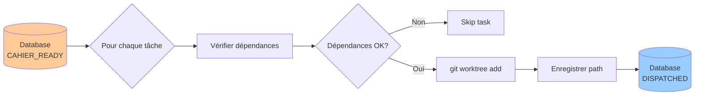
```mermaid
graph LR
    A[(Database<br/>CAHIER_READY)] --> B{Pour chaque tâche}
    B --> C[Vérifier dépendances]
    C --> D{Dépendances OK?}
    D -->|Non| E[Skip task]
    D -->|Oui| F[git worktree add]
    F --> G[Enregistrer path]
    G --> H[(Database<br/>DISPATCHED)]

    style A fill:#ffcc99
    style H fill:#99ccff
```

### 💻 Commandes Git Exécutées

Pour **chaque** tâche (ex: TASK-101) :

```bash
# 1. Créer une branche depuis main
git checkout main
git pull origin main

# 2. Créer le worktree isolé
git worktree add -b feature/TASK-101 .worktrees/TASK-101

# 3. Le worktree est prêt
# Arborescence créée :
# .worktrees/
# └── TASK-101/  ← Copie complète du repo sur branche feature/TASK-101
```

### 📁 Structure Créée

```
.worktrees/
├── TASK-101/          # Worktree pour tâche 101
│   ├── src/
│   ├── tests/
│   └── .git           # Lié au repo principal
├── TASK-102/          # Worktree pour tâche 102
└── TASK-201/          # Worktree pour tâche 201
```

### ✅ Avantages des Worktrees

| Avantage | Description |
|----------|-------------|
| 🔒 **Isolation complète** | Chaque agent travaille sur sa propre branche |
| ⚡ **Parallélisation** | Plusieurs agents développent simultanément |
| 🛡️ **Pas de conflits** | Impossible d'écraser le code d'un autre agent |
| 🔄 **Facilité de merge** | Chaque branche merge indépendamment |

### 🔧 Configuration

```yaml
phase1:
  enabled: true
  worktrees_dir: ".worktrees"  # Dossier des worktrees

  # Vérification des dépendances
  check_dependencies: true

  # Format des IDs de tâche
  task_id_format: "TASK-{counter:03d}"
  task_id_start: 101
```

---

## Phase 2 : Spécialistes (Implémentation avec Contexte)

### 🎯 Objectif

Implémenter le code de chaque tâche en injectant le **cahier des charges complet** comme contexte dans le prompt de l'agent.

### 📥 Input

- Tâches avec statut `DISPATCHED`
- Worktrees Git créés
- Cahiers des charges en base de données

### ⚙️ Workflow

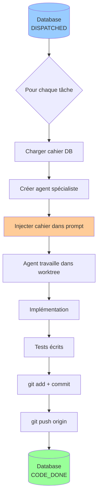
```mermaid
graph TD
    A[(Database<br/>DISPATCHED)] --> B{Pour chaque tâche}
    B --> C[Charger cahier DB]
    C --> D[Créer agent spécialiste]
    D --> E[Injecter cahier dans prompt]
    E --> F[Agent travaille dans worktree]
    F --> G[Implémentation]
    G --> H[Tests écrits]
    H --> I[git add + commit]
    I --> J[git push origin]
    J --> K[(Database<br/>CODE_DONE)]

    style A fill:#99ccff
    style E fill:#ffcc99
    style K fill:#99ff99
```

### 🔬 Injection de Contexte

Le système Blueprint distingue deux niveaux d'instructions pour les agents :

1. **Instructions de base** : Définies lors de la création de l'agent avec `/agent`, elles représentent son rôle fondamental et ses capacités générales (ex: "Tu es un développeur senior").

2. **Cahiers des charges** : Ce sont des prompts/tâches spécifiques donnés à l'agent, comme on donnerait des spécifications à un humain. Ils incluent le contexte détaillé, les restrictions et les contraintes propres à chaque tâche.

Cette approche simplifie le travail de l'agent et améliore sa compréhension en séparant clairement son rôle général de la tâche spécifique à accomplir.

```python
# Template de base (instructions générales de l'agent)
base_prompt = """
You are a senior software engineer.
Implement the following task...
"""

# Cahier des charges (prompt/tâche spécifique)
cahier_content = db.load_cahier_content(task_id)

# Fusion des deux niveaux d'instructions
enriched_prompt = f"""
{base_prompt}

---

## CAHIER DES CHARGES (Tâche Spécifique)

Le cahier des charges suivant définit votre tâche spécifique.
Suivez ses recommandations d'architecture, technologies et bonnes pratiques.
Il contient le contexte, les restrictions et les contraintes pour cette tâche.

{cahier_content}

---

**Task ID**: {task_id}
**Worktree**: .worktrees/{task_id}/
**Branch**: feature/{task_id}

Commencez l'implémentation en suivant les spécifications du cahier.
"""
```

### 📊 Comparaison Avant/Après

| Élément | Sans Cahier (v1.x) | Avec Cahier (v2.0) |
|---------|-------------------|-------------------|
| **Contexte** | Spec JSON simple | Cahier Markdown riche |
| **Recherche** | Aucune | Gemini CLI optionnel |
| **Recommandations** | Basiques | Best practices, architecture |
| **Qualité code** | Moyenne | Élevée (suit les recommandations) |

### 💻 Exemple de Worktree après Implémentation

```
.worktrees/TASK-101/
├── src/
│   └── security/
│       ├── sanitizer.js       ← Nouveau fichier
│       └── index.js
├── tests/
│   └── security/
│       └── sanitizer.test.js  ← Nouveau test
└── .git
    └── COMMIT_EDITMSG         ← "feat: implement XSS sanitizer"
```

### 🔧 Configuration

```yaml
phase2:
  enabled: true
  max_parallel_specialists: 3  # Nombre de spécialistes en parallèle

  # Template par défaut
  specialist_template: "senior-engineer"

  # Injection des cahiers (clé de la v2.0)
  inject_cahier_as_context: true

  # Qualité du code
  auto_format: true
  auto_lint: false
```

---

## Phase 3 : QA (Validation Parallèle)

### 🎯 Objectif

Double validation **parallèle** : logique (spec compliance) ET technique (tests).

> **Note v2.0**: Les agents verifier et tester sont maintenant créés automatiquement lors de l'exécution de Phase 3 s'ils n'existent pas. Ils sont configurés avec un accès en lecture complet au worktree et utilisent le mode `log` (audit) au lieu de `block`.

### 📥 Input

Tâches avec statut `CODE_DONE`

### ⚙️ Workflow

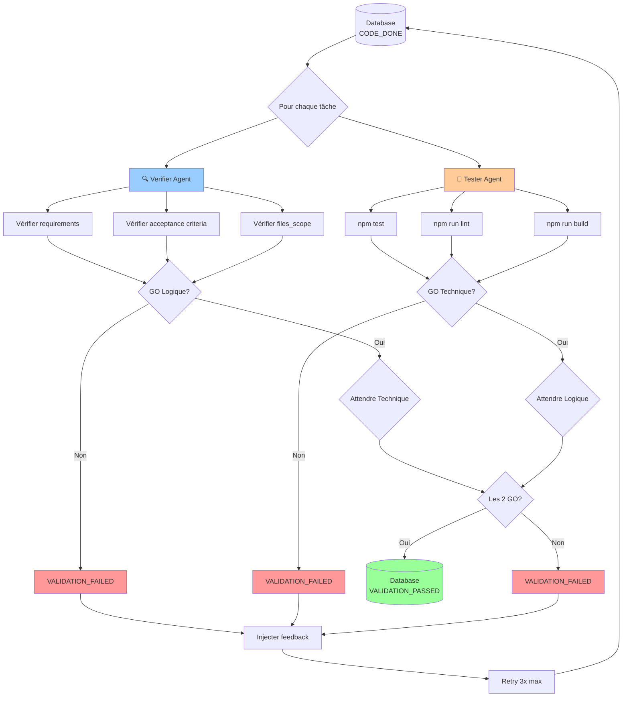
```mermaid
graph TD
    A[(Database<br/>CODE_DONE)] --> B{Pour chaque tâche}
    B --> C[🔍 Verifier Agent]
    B --> D[🧪 Tester Agent]

    C --> C1[Vérifier requirements]
    C --> C2[Vérifier acceptance criteria]
    C --> C3[Vérifier files_scope]
    C1 & C2 & C3 --> E{GO Logique?}

    D --> D1[npm test]
    D --> D2[npm run lint]
    D --> D3[npm run build]
    D1 & D2 & D3 --> F{GO Technique?}

    E -->|Oui| G{Attendre Technique}
    E -->|Non| H[VALIDATION_FAILED]
    F -->|Oui| I{Attendre Logique}
    F -->|Non| J[VALIDATION_FAILED]

    G & I --> K{Les 2 GO?}
    K -->|Oui| L[(Database<br/>VALIDATION_PASSED)]
    K -->|Non| M[VALIDATION_FAILED]

    H --> N[Injecter feedback]
    J --> N
    M --> N
    N --> O[Retry 3x max]
    O --> A

    style C fill:#99ccff
    style D fill:#ffcc99
    style L fill:#99ff99
    style H fill:#ff9999
    style J fill:#ff9999
    style M fill:#ff9999
```

### 🔍 A. Vérificateur (Validation Logique)

**Question** : *"Le code respecte-t-il la spec ?"*

**Vérifie** :

1. ✅ **Requirements** : Tous les objectifs implémentés ?
2. ✅ **Acceptance Criteria** : Tous les critères validés ?
3. ✅ **Files Scope** : Seulement les fichiers autorisés modifiés ?

**Output** :

```json
{
  "validation_type": "logic",
  "status": "pass",
  "coverage": 1.0,
  "details": {
    "requirements_met": ["REQ-1", "REQ-2", "REQ-3"],
    "requirements_missing": [],
    "criteria_validated": ["CRI-1", "CRI-2"],
    "files_out_of_scope": []
  }
}
```

### 🧪 B. Testeur (Validation Technique)

**Question** : *"Le code fonctionne-t-il techniquement ?"*

**Exécute** :

```bash
# Dans le worktree de la tâche
cd .worktrees/TASK-101

# 1. Tests unitaires
npm test

# 2. Linting
npm run lint

# 3. Build (si applicable)
npm run build
```

**Output** :

```json
{
  "validation_type": "tech",
  "status": "fail",
  "details": {
    "tests": {
      "total": 12,
      "passed": 11,
      "failed": 1,
      "failures": [
        {
          "test": "should reject XSS in nested objects",
          "error": "Expected 'sanitized' but got 'unsanitized'"
        }
      ]
    },
    "lint": {
      "status": "pass",
      "warnings": 2
    },
    "build": {
      "status": "pass"
    }
  }
}
```

### 🔄 Boucle de Retry avec Feedback

Si la validation échoue, le système **réessaie automatiquement** (max 3 fois) en injectant le feedback :

```
=== RETRY ATTEMPT 2/3 ===

Previous validation failed with 2 issues:

Logic Validation:
  ❌ Requirement "Must handle null values" NOT MET

Technical Validation:
  ❌ Test "should reject XSS in nested objects" FAILED
     Expected: 'sanitized'
     Actual: 'unsanitized'

Please fix these specific issues and retry.
```

### 🔧 Configuration

```yaml
phase3:
  enabled: true
  parallel_execution: true  # Verifier ET Tester en parallèle

  # Vérificateur
  verifier:
    enabled: true
    strict_mode: true
    check_files_scope: true

  # Testeur
  tester:
    enabled: true
    auto_run_tests: true
    test_commands:
      - "npm test"
      - "npm run lint"
    create_issues_on_failure: true  # Crée GitHub Issue si échec
```

---

## Phase 4 : Merger (Intégration Sécurisée)

### 🎯 Objectif

Intégrer les tâches validées dans `main` avec **gestion sécurisée des conflits**.

### 📥 Input

Tâches avec statut `VALIDATION_PASSED`

### ⚙️ Workflow

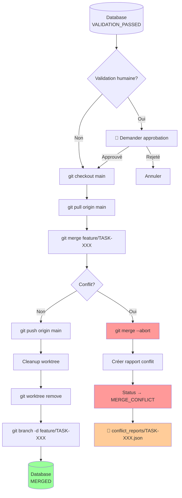
```mermaid
graph TD
    A[(Database<br/>VALIDATION_PASSED)] --> B{Validation humaine?}
    B -->|Oui| C[👤 Demander approbation]
    B -->|Non| D[git checkout main]
    C -->|Approuvé| D
    C -->|Rejeté| Z[Annuler]

    D --> E[git pull origin main]
    E --> F[git merge feature/TASK-XXX]
    F --> G{Conflit?}

    G -->|Non| H[git push origin main]
    G -->|Oui| I[git merge --abort]

    H --> J[Cleanup worktree]
    J --> K[git worktree remove]
    K --> L[git branch -d feature/TASK-XXX]
    L --> M[(Database<br/>MERGED)]

    I --> N[Créer rapport conflit]
    N --> O[Status → MERGE_CONFLICT]
    O --> P[📄 conflict_reports/TASK-XXX.json]

    style M fill:#99ff99
    style I fill:#ff9999
    style O fill:#ff9999
    style P fill:#ffcc99
```

### 🛡️ Gestion Sécurisée des Conflits

**IMPORTANT** : Blueprint **N'AUTO-RÉSOUT JAMAIS** les conflits pour éviter l'écrasement de code.

#### Comportement en Cas de Conflit

```bash
# 1. Tentative de merge
git merge feature/TASK-101

# 2. Conflit détecté
# CONFLICT (content): Merge conflict in src/security/sanitizer.js

# 3. ABORT IMMÉDIAT (sécurité)
git merge --abort

# 4. Repo main reste PROPRE (aucun état de merge incomplet)
```

#### Rapport de Conflit Généré

```json
{
  "task_id": "TASK-101",
  "branch": "feature/TASK-101",
  "timestamp": "2025-01-02T15:30:22Z",
  "conflicting_files": [
    "src/security/sanitizer.js",
    "tests/security/sanitizer.test.js"
  ],
  "resolution_instructions": [
    "1. git checkout feature/TASK-101",
    "2. git rebase main",
    "3. Résoudre les conflits manuellement dans les fichiers listés",
    "4. git add <fichiers résolus>",
    "5. git rebase --continue",
    "6. git push origin feature/TASK-101 --force-with-lease",
    "7. Relancer Phase 4 pour merger"
  ],
  "base_commit": "a1b2c3d",
  "feature_commit": "e4f5g6h",
  "conflicting_changes": {
    "src/security/sanitizer.js": {
      "base_lines": "15-23",
      "feature_lines": "15-28",
      "description": "Both branches modified the sanitize() function"
    }
  }
}
```

### ✅ Garanties de Sécurité

| Garantie | Mécanisme |
|----------|-----------|
| 🛡️ **Repo toujours propre** | `git merge --abort` automatique |
| 📋 **Traçabilité complète** | Rapport détaillé dans `conflict_reports/` |
| 🚫 **Aucune auto-résolution** | Fonctionnalité supprimée volontairement |
| 👤 **Validation humaine** | Option `require_human_validation` |
| 🔒 **Merge séquentiel** | Une tâche à la fois |

### 🔧 Configuration

```yaml
phase4:
  enabled: true

  # Validation humaine recommandée
  require_human_validation: true

  # Merge settings
  auto_merge: false  # Requiert require_human_validation: false
  cleanup_after_merge: true  # Supprime worktree + branche après succès

  # Gestion de conflits (SÉCURISÉE)
  on_conflict: "prompt_user"  # Résolution manuelle OBLIGATOIRE
  create_conflict_report: true

  # Batch merging (optionnel)
  batch_merge_enabled: false
  max_batch_size: 5
```

---

## 📦 Installation

### Prérequis

| Logiciel | Version Minimale | Vérification |
|----------|------------------|--------------|
| Python | 3.9+ | `python --version` |
| Git | 2.20+ | `git --version` |
| Node.js | 14+ (optionnel) | `node --version` |
| WSL | 2 (Windows uniquement) | `wsl --status` |

### Étape 1 : Cloner le Projet

```bash
# Cloner le repository
git clone https://github.com/yourusername/blueprint.git
cd blueprint

# Vérifier que vous êtes sur main
git checkout main
```

### Étape 2 : Installer les Dépendances Python

```bash
# Créer un environnement virtuel (recommandé)
python -m venv venv

# Activer l'environnement
# Windows
venv\Scripts\activate
# Linux/Mac
source venv/bin/activate

# Installer les dépendances
pip install -r requirements.txt
```

### Étape 3 : Configuration Gemini CLI (Optionnel)

Pour activer la recherche externe avec Gemini CLI :

**Installation** :
```bash
# Option A : Installation globale
npm install -g @google/gemini-cli

# Option B : Utilisation via npx (sans installation)
# Vérifier que npx est disponible
npx --version
```

**Authentification** :
```bash
# Option 1 : OAuth Login (Recommandé)
gemini auth login  # ou npx @google/gemini-cli auth login

# Option 2 : API Key (Variable d'environnement)
# Windows
set GEMINI_API_KEY="votre-clé-api"
# Linux/Mac
export GEMINI_API_KEY="votre-clé-api"
```

**Test** :
```bash
# Windows
npx.cmd @google/gemini-cli "Test" --output-format json

# Linux/Mac
npx @google/gemini-cli "Test" --output-format json
```

📚 Voir [`docs/GEMINI_CLI_SETUP.md`](docs/GEMINI_CLI_SETUP.md) pour plus de détails.

### Étape 4 : Initialiser la Base de Données

```bash
# Créer pipeline.db et les tables
python orchestrator/main.py init
```

**Output attendu** :
```
✅ Database initialized: pipeline.db
✅ Git helper initialized for: C:\Users\...\Blueprint
✅ Pipeline initialized successfully
```

### Étape 5 : Vérifier l'Installation

```bash
# Afficher le statut
python orchestrator/main.py status
```

**Output attendu** :
```
=== Pipeline Status ===
Tasks:
  - CAHIER_READY: 0
  - DISPATCHED: 0
  - CODE_DONE: 0
  - VALIDATION_PASSED: 0
  - MERGED: 0

Agents created: 0
```

---

## 🚀 Guide de Démarrage Rapide

### Prérequis

Avant de commencer, assurez-vous que :
1. Blueprint est installé dans son propre répertoire
2. Votre projet cible est un dépôt Git initialisé
3. Vous connaissez le chemin vers votre projet cible

### Exemple Complet : "Améliorer la Sécurité" sur un Projet Externe

#### 1️⃣ Lancer le Pipeline Complet sur un Projet Externe

```bash
# Option 1: Avec le paramètre --project
python orchestrator/main.py start "Améliorer la sécurité de l'application" --project /path/to/mon-projet

# Option 2: Configurer un projet par défaut (pipeline_config.yaml)
# general:
#   default_target_project: /path/to/mon-projet
python orchestrator/main.py start "Améliorer la sécurité de l'application"

# Option 3: Travailler sur Blueprint lui-même (développement)
python orchestrator/main.py start "Améliorer la sécurité" --project .
```

**Ce qui se passe** :

```
[Blueprint Directory]
📁 Blueprint/
├── 📄 pipeline.db                    # État du pipeline
├── 📁 cahiers_charges/               # Cahiers générés
│   ├── Security/
│   │   ├── TASK-101_cahier.md
│   │   └── TASK-102_cahier.md
│   └── Authentication/
│       └── TASK-201_cahier.md
└── 📁 logs/                          # Logs d'orchestration

[Votre Projet]
📁 /path/to/mon-projet/
├── 📁 .worktrees/                    # Worktrees créés ici
│   ├── TASK-101/                     # Code isolé par tâche
│   ├── TASK-102/
│   └── TASK-201/
├── 📁 src/                           # Votre code source
└── .git/                             # Git repository

=== PHASE 0: Master Analyst + Analystes ===
🧑‍💼 Master Analyst analyse la requête...
✅ Domaines identifiés: Security, Authentication, API

📝 Création de 3 analystes en parallèle...
✅ Analyst(Security) → Cahier créé → 3 tâches générées
   └── Cahier sauvegardé dans: Blueprint/cahiers_charges/Security/
✅ Analyst(Authentication) → Cahier créé → 2 tâches générées
✅ Analyst(API) → Cahier créé → 3 tâches générées

📊 Phase 0 terminée: 8 tâches créées (CAHIER_READY)

=== PHASE 0.5: Enrichissement Gemini (optionnel) ===
🌟 Enrichissement séquentiel des cahiers...
🔍 Security: Good Practices → Modern Approaches → Real-world Context
🔍 Authentication: Good Practices → Modern Approaches → Real-world Context
🔍 API: Good Practices → Modern Approaches → Real-world Context
✅ 3 domaines enrichis avec bonnes pratiques 2025

📊 Phase 0.5 terminée: 8 cahiers enrichis

=== PHASE 1: Dispatcher ===
🌳 Création de worktrees pour 8 tâches dans /path/to/mon-projet/.worktrees/
✅ TASK-101 → /path/to/mon-projet/.worktrees/TASK-101 (branch: feature/TASK-101)
✅ TASK-102 → /path/to/mon-projet/.worktrees/TASK-102 (branch: feature/TASK-102)
...

📊 Phase 1 terminée: 8 tâches dispatched

=== PHASE 2: Spécialistes ===
👨‍💻 Création de 3 spécialistes en parallèle...
✅ Specialist(TASK-101) → Code implémenté + committé
✅ Specialist(TASK-102) → Code implémenté + committé
...

📊 Phase 2 terminée: 8 tâches implémentées

=== PHASE 3: QA ===
🔍 Validation de 8 tâches...
✅ TASK-101 → VALIDATION_PASSED
⚠️  TASK-102 → VALIDATION_FAILED (retry avec feedback)
✅ TASK-102 → VALIDATION_PASSED (retry 1/3)
...

📊 Phase 3 terminée: 7/8 validées (1 échec définitif)

=== PHASE 4: Merger ===
🔀 Merge de 7 tâches validées...
✅ TASK-101 → MERGED
✅ TASK-103 → MERGED
⚠️  TASK-201 → MERGE_CONFLICT (rapport créé)
...

📊 Phase 4 terminée: 6/7 mergées (1 conflit)

=== PIPELINE COMPLETE ===
✅ 6 tâches intégrées dans main
⚠️  1 conflit nécessite résolution manuelle
❌ 1 échec de validation permanent
```

#### 2️⃣ Ou Lancer Phase par Phase

```bash
# Toutes les commandes supportent --project
# Phase 0 : Génération des cahiers (dans Blueprint/)
python orchestrator/main.py run-phase 0 --requirement "Améliorer la sécurité" --project /path/to/mon-projet

# Vérifier les cahiers générés (dans Blueprint/)
ls cahiers_charges/Security/

# Phase 0.5 : Enrichissement Gemini (optionnel)
python orchestrator/main.py run-phase 0.5 --project /path/to/mon-projet

# Vérifier l'enrichissement
cat cahiers_charges/Security/TASK-101_cahier.md | grep "ENRICHISSEMENT GEMINI"

# Phase 1 : Création des worktrees (dans le projet cible)
python orchestrator/main.py run-phase 1 --project /path/to/mon-projet

# Vérifier les worktrees (dans le projet cible)
cd /path/to/mon-projet && git worktree list

# Phase 2 : Implémentation
python orchestrator/main.py run-phase 2 --project /path/to/mon-projet

# Phase 3 : Validation
python orchestrator/main.py run-phase 3 --project /path/to/mon-projet

# Phase 4 : Merge
python orchestrator/main.py run-phase 4 --project /path/to/mon-projet
```

---

## 🎯 Travailler avec des Projets Externes

### Concepts Clés

Blueprint fonctionne comme un **orchestrateur externe** qui peut gérer le développement de n'importe quel projet Git, sans modifier son propre code source.

#### Architecture de Séparation

```mermaid
graph LR
    A[📁 Blueprint Directory] -->|Orchestration| B[📁 Target Project]

    subgraph Blueprint
        A1[pipeline.db<br/>État & Tasks]
        A2[cahiers_charges/<br/>Documentation]
        A3[logs/<br/>Historique]
    end

    subgraph "Target Project"
        B1[.worktrees/<br/>Code isolé]
        B2[src/<br/>Code source]
        B3[main branch<br/>Code intégré]
    end

    style Blueprint fill:#fff9e1
    style "Target Project" fill:#e1ffe1
```

**Avantages de cette architecture** :
- ✅ **Réutilisabilité** : Un Blueprint pour plusieurs projets
- ✅ **Propreté** : Pas de pollution entre orchestrateur et code
- ✅ **Traçabilité** : Cahiers des charges centralisés pour audit
- ✅ **Sécurité** : Le code source n'est jamais dans Blueprint

### Configuration du Projet Cible

#### Option 1 : Paramètre CLI (Recommandé pour tests)

```bash
# Toujours spécifier --project pour chaque commande
python orchestrator/main.py start "requirement" --project /path/to/my-app
python orchestrator/main.py run-phase 1 --project /path/to/my-app
python orchestrator/main.py status --project /path/to/my-app
python orchestrator/main.py cleanup --project /path/to/my-app
```

**Avantages** :
- Flexible : change facilement de projet
- Explicite : toujours clair sur quel projet vous travaillez
- Sécurisé : pas de risque de modifier le mauvais projet

#### Option 2 : Configuration par Défaut (Recommandé pour production)

**Éditer `config/pipeline_config.yaml`** :

```yaml
general:
  project_name: "Generative Agent Pipeline"
  version: "2.0.0"

  # Projet cible par défaut
  default_target_project: "/path/to/my-app"  # Chemin absolu ou relatif
  # Exemples :
  # default_target_project: "/home/user/projects/my-app"
  # default_target_project: "~/projects/my-app"
  # default_target_project: "../my-app"
```

**Utilisation** :

```bash
# Plus besoin de --project si default_target_project est configuré
python orchestrator/main.py start "requirement"
python orchestrator/main.py status
```

**⚠️ Note** : Le paramètre `--project` a toujours la priorité sur `default_target_project`.

### Où Vont les Fichiers ?

| Fichier/Répertoire | Emplacement | Raison |
|-------------------|-------------|---------|
| `pipeline.db` | **Blueprint/** | État centralisé du pipeline |
| `cahiers_charges/` | **Blueprint/** | Documentation de planification |
| `logs/` | **Blueprint/** | Logs d'orchestration |
| `.worktrees/` | **Projet cible/** | Isolation du code par tâche |
| `feature/*` branches | **Projet cible/** | Branches de développement |
| Code mergé | **Projet cible/main** | Code production final |

### Exemples Complets

#### Exemple 1 : Plusieurs Projets en Parallèle

```bash
# Projet A : Application Web
python orchestrator/main.py start "Add user authentication" --project ~/projects/web-app

# Pendant que le pipeline tourne, lancer sur un autre projet
# Projet B : API Backend
python orchestrator/main.py start "Implement caching layer" --project ~/projects/api-backend

# Les deux pipelines sont indépendants :
# - Même pipeline.db mais tasks différentes (task_id uniques)
# - Cahiers dans des domaines différents
# - Code dans des projets différents
```

#### Exemple 2 : Workflow Développeur

```bash
# 1. Initialiser Blueprint pour un nouveau projet
cd ~/Blueprint
python orchestrator/main.py init --project ~/my-new-app

# 2. Planifier la feature (Phase 0 seulement)
python orchestrator/main.py run-phase 0 \
  --requirement "Build REST API for user management" \
  --project ~/my-new-app

# 3. Vérifier les cahiers générés (dans Blueprint)
ls cahiers_charges/
cat cahiers_charges/API/TASK-101_cahier.md

# 4. Si satisfait, lancer l'implémentation
python orchestrator/main.py run-phase 1 --project ~/my-new-app
python orchestrator/main.py run-phase 2 --project ~/my-new-app

# 5. Le code est dans ~/my-new-app/.worktrees/
cd ~/my-new-app
git worktree list

# 6. Valider et merger
cd ~/Blueprint
python orchestrator/main.py run-phase 3 --project ~/my-new-app
python orchestrator/main.py run-phase 4 --project ~/my-new-app
```

#### Exemple 3 : Développement Blueprint Lui-Même

```bash
# Pour améliorer Blueprint, pointer vers lui-même
cd ~/Blueprint
python orchestrator/main.py start "Add new feature to Blueprint" --project .

# Ou en absolu
python orchestrator/main.py start "Add new feature" --project /home/user/Blueprint
```

### Prérequis du Projet Cible

Le projet cible **doit** :
1. ✅ Être un dépôt Git initialisé (`git init`)
2. ✅ Avoir au moins un commit initial
3. ✅ Avoir une branche `main` ou `master`
4. ✅ Être accessible en lecture/écriture

Le projet cible **n'a pas besoin** de :
- ❌ Contenir du code (peut être vide)
- ❌ Avoir une structure spécifique
- ❌ Être dans le même langage de programmation

### Vérification

Pour vérifier que votre projet cible est prêt :

```bash
cd /path/to/mon-projet

# Vérifier que c'est un repo Git
git status

# Vérifier la branche principale
git branch

# Vérifier qu'il y a au moins un commit
git log -1

# Si tout est OK, lancer Blueprint
cd ~/Blueprint
python orchestrator/main.py start "requirement" --project /path/to/mon-projet
```

---

## 🧹 Nettoyage et Maintenance

### Pourquoi Nettoyer ?

Lorsqu'un pipeline échoue ou est interrompu, des ressources temporaires peuvent rester :
- 📄 **Cahiers des charges** orphelins (dans Blueprint/)
- 🌳 **Worktrees** vides ou incomplets (dans le projet cible)
- 🗄️ **Entrées de base de données** pour des tâches non finalisées

Blueprint fournit un système de nettoyage intelligent qui **distingue** :
- **Documents de planification** (cahiers) → toujours nettoyables
- **Code réel** (worktrees avec commits) → protégé par défaut

### Commande `cleanup`

```bash
python orchestrator/main.py cleanup --project /path/to/mon-projet [OPTIONS]
```

#### Options

| Option | Description | Comportement |
|--------|-------------|--------------|
| `--dry-run` | Mode simulation | Affiche ce qui serait nettoyé sans rien supprimer |
| `--force` | Nettoyage forcé | Supprime TOUT y compris le code (dangereux !) |
| *(aucune)* | Mode par défaut | Nettoie seulement les ressources orphelines |

### Modes de Nettoyage

#### Mode 1 : Nettoyage Standard (Sécurisé)

**Sans option, nettoyage intelligent des ressources orphelines** :

```bash
python orchestrator/main.py cleanup --project /path/to/mon-projet
```

**Ce qui est nettoyé** :
- ✅ Cahiers des charges (tous, toujours dans Blueprint/)
- ✅ Worktrees **vides** (aucun commit = pas de code)
- ✅ Index des cahiers (`cahiers_charges/index.json`)
- ❌ Worktrees avec code (protégés !)
- ❌ Base de données (conservée pour historique)

**Exemple de sortie** :

```
=== CLEANUP - Orphaned Resources ===
Found 3 cahier domains to clean
Found 2 worktrees to clean

Proceed with cleanup? [Y/n]: y

✅ Removed cahier domain: Security
✅ Removed cahier domain: API
✅ Removed cahier domain: Authentication
✅ Removed empty worktree: TASK-101 (0 commits)
✅ Removed empty worktree: TASK-105 (0 commits)
⚠️  Kept worktree: TASK-102 (has 3 commits)
⚠️  Kept worktree: TASK-103 (has 1 commit)

Cleanup complete!
```

#### Mode 2 : Dry-Run (Aperçu)

**Voir ce qui serait nettoyé sans rien supprimer** :

```bash
python orchestrator/main.py cleanup --project /path/to/mon-projet --dry-run
```

**Utilité** :
- ✅ Vérifier ce qui sera supprimé avant confirmation
- ✅ Détecter des worktrees oubliés
- ✅ Auditer les ressources orphelines

**Exemple de sortie** :

```
=== CLEANUP - Orphaned Resources ===
⚠️  DRY RUN MODE - No changes will be made

Found 3 cahier domains to clean:
  - cahiers_charges/Security/
  - cahiers_charges/API/
  - cahiers_charges/Authentication/

Found 2 worktrees to clean:
  - .worktrees/TASK-101 (empty, 0 commits)
  - .worktrees/TASK-105 (empty, 0 commits)

Worktrees to keep (have commits):
  - .worktrees/TASK-102 (3 commits)
  - .worktrees/TASK-103 (1 commit)

No changes made (dry-run mode)
```

#### Mode 3 : Force (Dangereux ⚠️)

**Nettoyer TOUT y compris le code généré** :

```bash
python orchestrator/main.py cleanup --project /path/to/mon-projet --force
```

**⚠️ ATTENTION** : Ce mode supprime **TOUT**, même les worktrees avec du code !

**Ce qui est nettoyé** :
- ✅ Tous les cahiers des charges
- ✅ **TOUS** les worktrees (même avec commits)
- ✅ Entrées de base de données pour tâches non mergées
- ✅ Index des cahiers

**Cas d'usage recommandés** :
- 🔴 Pipeline échoué en Phase 0 ou 1 (aucun code généré)
- 🔴 Reset complet pour recommencer
- 🔴 Nettoyage après tests

### Cleanup Automatique

Blueprint inclut aussi un **cleanup automatique** en cas d'échec :

#### Cleanup Phase-Aware

Le pipeline détecte automatiquement quelle phase a échoué et adapte le nettoyage :

```python
# Intégré dans Pipeline.cleanup()

# Si échec en Phase 0, 0.5, ou 1 → cleanup complet (aucun code)
if failed_phase in ['phase0', 'phase0_5', 'phase1']:
    await self._cleanup_all_temp_files()  # Supprime tout

# Si échec en Phase 2, 3, ou 4 → cleanup cahiers seulement (protéger code)
else:
    await self._cleanup_cahiers_only()  # Garde le code
```

**Exemple de nettoyage automatique** :

```bash
python orchestrator/main.py start "requirement" --project /path/to/mon-projet

# [Pipeline s'exécute...]
# [Erreur en Phase 0]

❌ Phase 0 failed: Master analyst error
🧹 Auto-cleanup: Removing planning documents and empty worktrees
✅ Cleanup complete (no code was generated)
```

### Commande `reset`

**Réinitialiser complètement la base de données** :

```bash
python orchestrator/main.py reset
```

**⚠️ ATTENTION** : Supprime `pipeline.db` et tout l'historique !

**Ce qui est supprimé** :
- ✅ Base de données (`pipeline.db`)
- ✅ Tout l'historique des tâches
- ✅ Toutes les traces d'agents

**Ce qui est conservé** :
- ❌ Cahiers des charges (dans Blueprint/)
- ❌ Worktrees (dans le projet cible)
- ❌ Branches git (dans le projet cible)

### Exemples Pratiques

#### Exemple 1 : Pipeline Interrompu (Ctrl+C en Phase 2)

```bash
# 1. Vérifier l'état
python orchestrator/main.py status --project /path/to/mon-projet
# Output: 3 tasks SPECIALIST_WORKING, 2 tasks CODE_DONE

# 2. Aperçu du nettoyage
python orchestrator/main.py cleanup --project /path/to/mon-projet --dry-run

# 3. Nettoyer (protège le code)
python orchestrator/main.py cleanup --project /path/to/mon-projet
# Output: Cahiers supprimés, worktrees vides supprimés, code conservé

# 4. Reprendre si besoin
python orchestrator/main.py run-phase 2 --project /path/to/mon-projet
```

#### Exemple 2 : Échec en Phase 0 (Aucun Code Généré)

```bash
# 1. Échec détecté
❌ Phase 0 failed: Invalid requirement

# 2. Nettoyage total (sans risque)
python orchestrator/main.py cleanup --project /path/to/mon-projet --force
# Output: Tout nettoyé (aucun code n'existait)

# 3. Recommencer
python orchestrator/main.py start "corrected requirement" --project /path/to/mon-projet
```

---

## ⚙️ Configuration

Le fichier [config/pipeline_config.yaml](config/pipeline_config.yaml) contrôle tous les aspects du pipeline.

### Configuration de Base

```yaml
# Général
general:
  project_name: "Generative Agent Pipeline"
  log_level: "INFO"  # DEBUG, INFO, WARNING, ERROR
  log_file: "logs/pipeline.log"

  # Projet cible par défaut (optionnel)
  # Si non spécifié, doit être fourni via --project CLI option
  default_target_project: null  # ou /path/to/votre-projet
  # Exemples :
  # default_target_project: "/home/user/projects/my-app"
  # default_target_project: "~/projects/my-app"
  # default_target_project: "../my-app"
  # default_target_project: "."  # Pour travailler sur Blueprint lui-même

# Base de données
database:
  path: "pipeline.db"
  backup_enabled: true

# Git
git:
  base_branch: "main"
  worktrees_dir: ".worktrees"
  merge_strategy: "recursive"
  conflict_resolution: "manual"  # IMPORTANT: toujours manuel
```

### Configuration des Phases

```yaml
# Phase 0: Analystes
phase0:
  enabled: true
  max_parallel_analysts: 5
  enable_gemini_research: false  # Optionnel
  cahiers_charges_dir: "cahiers_charges"

# Phase 1: Dispatcher
phase1:
  enabled: true
  check_dependencies: true

# Phase 2: Spécialistes
phase2:
  enabled: true
  max_parallel_specialists: 3
  inject_cahier_as_context: true  # Clé de la v2.0

# Phase 3: QA
phase3:
  enabled: true
  parallel_execution: true  # Verifier + Tester en //

# Phase 4: Merger
phase4:
  enabled: true
  require_human_validation: true  # Recommandé
  on_conflict: "prompt_user"
  create_conflict_report: true
```

### Configuration Gemini CLI (Optionnel)

Blueprint utilise Gemini CLI pour enrichir les cahiers des charges avec des recherches externes sur les best practices, la sécurité et la documentation.

**1. Installation de Gemini CLI** :

```bash
# Option A : Installation globale
npm install -g @google/gemini-cli

# Option B : Utilisation via npx (sans installation)
npx @google/gemini-cli --version
```

**2. Authentification** :

```bash
# Option 1 : OAuth Login (Recommandé)
gemini auth login  # ou npx @google/gemini-cli auth login

# Option 2 : API Key (Variable d'environnement)
export GEMINI_API_KEY="votre-clé-api"
```

**3. Configuration dans pipeline_config.yaml** :

```yaml
gemini:
  use_cli: true  # Utilise Gemini CLI
  enabled: false  # Mettre à true pour activer
  cli_model: "gemini-2.5-pro"  # ou "gemini-2.5-flash" pour plus rapide
  cli_timeout: 30  # Timeout en secondes
  cache_results: false  # Cache optionnel

phase0:
  enable_gemini_research: true  # Active la recherche pour les analystes
  gemini_model: "gemini-2.5-pro"
```

**Test de fonctionnement** :

```bash
# Windows
npx.cmd @google/gemini-cli "Hello" --output-format json

# Linux/WSL
npx @google/gemini-cli "Hello" --output-format json
```

📚 **Documentation complète** : Voir [`docs/GEMINI_CLI_SETUP.md`](docs/GEMINI_CLI_SETUP.md)

### Configuration Avancée

#### Gestion d'Erreurs

```yaml
error_handling:
  max_retries: 3
  retry_delay: 10  # secondes
  enable_retry_loop: true  # Boucle de correction
  inject_feedback: true  # Feedback détaillé aux agents

  on_validation_failure:
    action: "retry"  # retry, skip, abort
    max_attempts: 3
```

#### Sécurité

```yaml
security:
  validate_file_paths: true
  allowed_file_extensions:
    - ".js"
    - ".ts"
    - ".py"

  protect_branches:
    - "main"
    - "master"
    - "production"

  # Access Control (granular)
  access_control:
    enabled: true
    mode: "block"  # block, log, ask
    sensitive_paths:
      - "**/.env"
      - "**/.env.*"
      - "**/secrets.json"
```

---

## 📖 Exemples d'Utilisation

### Exemple 1 : Feature Complète

```bash
# Requête
python orchestrator/main.py start "Ajouter un système de notifications par email"

# Résultat
# Phase 0 : Master identifie → Email, Queue, Templates
# Phase 0 : 3 Analysts → 9 tâches créées
# Phase 1-4 : Pipeline complet
# Output : 9 features mergées dans main
```

### Exemple 2 : Refactoring de Code

```bash
python orchestrator/main.py start "Refactoriser le module d'authentification pour utiliser TypeScript"

# Résultat
# Phase 0 : Master identifie → TypeScript Migration, Auth Module
# Phase 0 : 2 Analysts → 6 tâches créées
# ...
```

### Exemple 3 : Correction de Bugs

```bash
python orchestrator/main.py start "Corriger le bug de fuite mémoire dans le système de cache"

# Résultat
# Phase 0 : Master identifie → Caching, Performance
# Phase 0 : 2 Analysts → 4 tâches créées
# ...
```

### Exemple 4 : Lancer seulement Phase 0 pour Planification

```bash
# Générer seulement les cahiers (pas d'implémentation)
python orchestrator/main.py run-phase 0 --requirement "Migrer vers React 18"

# Inspecter les cahiers générés
cat cahiers_charges/Frontend/rapport_analyse.md
cat cahiers_charges/Frontend/TASK-101_cahier.md

# Décider manuellement si continuer
python orchestrator/main.py run-phase 1  # Si satisfait
```

---

## 📂 Structure du Projet

```
Blueprint/
│
├── 📁 config/                          # Configuration
│   ├── pipeline_config.yaml            # Config principale ⚙️
│   ├── spec_schema.json                # Schéma JSON specs (legacy)
│   └── template_sources.yaml           # Sources templates agents
│
├── 📁 cahiers_charges/                 # Cahiers des charges (v2.0) ✨
│   ├── index.json                      # Index global
│   ├── Security/
│   │   ├── rapport_analyse.md          # Rapport domaine Security
│   │   ├── TASK-101_cahier.md          # Cahier XSS Protection
│   │   └── TASK-102_cahier.md          # Cahier Input Validation
│   ├── Authentication/
│   │   └── rapport_analyse.md
│   └── API/
│       └── rapport_analyse.md
│
├── 📁 .worktrees/                      # Git worktrees (Phase 1)
│   ├── TASK-101/                       # Worktree isolé pour tâche 101
│   ├── TASK-102/
│   └── TASK-201/
│
├── 📁 conflict_reports/                # Rapports de conflits Git
│   ├── TASK-201_conflict.json
│   └── TASK-305_conflict.json
│
├── 📁 orchestrator/                    # Code principal 🎼
│   │
│   ├── main.py                         # Point d'entrée CLI
│   ├── db.py                           # Gestion SQLite
│   ├── agent_factory.py                # Création agents + injection cahiers
│   │
│   ├── 📁 agents/
│   │   └── gemini_researcher.py        # Recherche externe via Gemini CLI
│   │
│   ├── 📁 phases/
│   │   ├── phase0_master_analysts.py   # Phase 0: Master + Analystes
│   │   ├── phase1_dispatcher.py        # Phase 1: Dispatcher
│   │   ├── phase2_specialists.py       # Phase 2: Spécialistes
│   │   ├── phase3_qa.py                # Phase 3: QA
│   │   └── phase4_merger.py            # Phase 4: Merger
│   │
│   └── 📁 utils/
│       ├── git_helper.py               # Opérations Git/Worktrees
│       ├── logger.py                   # Logging centralisé
│       ├── access_control.py           # Contrôle d'accès fichiers
│       ├── template_downloader.py      # Téléchargement templates GitHub
│       └── template_converter.py       # Conversion templates
│
├── 📁 logs/                            # Logs du pipeline
│   ├── pipeline.log                    # Log principal
│   └── access_violations.log           # Violations access control
│
├── 📁 docs/                            # Documentation technique
│   ├── REFACTORING_PROGRESS.md
│   ├── IMPLEMENTATION_SUMMARY.md
│   └── FINAL_STATUS.md
│
├── pipeline.db                         # Base de données SQLite 🗄️
├── requirements.txt                    # Dépendances Python
├── README.md                           # Ce fichier
└── .gitignore
```

---

## 🗄️ Base de Données

Blueprint utilise **SQLite** (`pipeline.db`) pour tracker l'état complet du pipeline.

### Schéma de la Base de Données

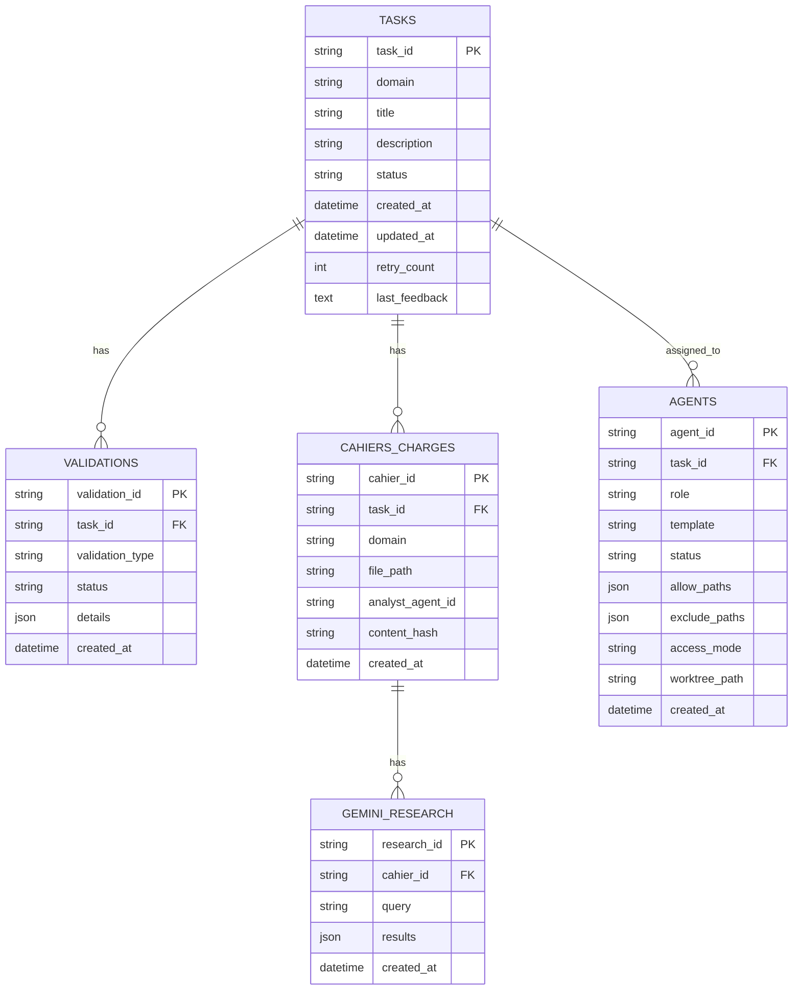
```mermaid
erDiagram
    TASKS ||--o{ VALIDATIONS : "has"
    TASKS ||--o{ CAHIERS_CHARGES : "has"
    CAHIERS_CHARGES ||--o{ GEMINI_RESEARCH : "has"
    TASKS ||--o{ AGENTS : "assigned_to"

    TASKS {
        string task_id PK
        string domain
        string title
        string description
        string status
        datetime created_at
        datetime updated_at
        int retry_count
        text last_feedback
    }

    AGENTS {
        string agent_id PK
        string task_id FK
        string role
        string template
        string status
        json allow_paths
        json exclude_paths
        string access_mode
        string worktree_path
        datetime created_at
    }

    VALIDATIONS {
        string validation_id PK
        string task_id FK
        string validation_type
        string status
        json details
        datetime created_at
    }

    CAHIERS_CHARGES {
        string cahier_id PK
        string task_id FK
        string domain
        string file_path
        string analyst_agent_id
        string content_hash
        datetime created_at
    }

    GEMINI_RESEARCH {
        string research_id PK
        string cahier_id FK
        string query
        json results
        datetime created_at
    }
```

### Tables Principales

#### 1. `tasks`

Toutes les tâches du pipeline.

```sql
CREATE TABLE tasks (
    task_id TEXT PRIMARY KEY,
    domain TEXT,
    title TEXT,
    description TEXT,
    status TEXT,  -- CAHIER_READY, DISPATCHED, CODE_DONE, etc.
    spec_json TEXT,
    worktree_path TEXT,
    branch_name TEXT,
    created_at TIMESTAMP,
    updated_at TIMESTAMP,
    retry_count INTEGER DEFAULT 0,
    last_feedback TEXT
);
```

**Statuts possibles** :
- `CAHIER_READY` : Cahier créé, prêt pour dispatch
- `DISPATCHED` : Worktree créé
- `SPECIALIST_WORKING` : Spécialiste en cours
- `CODE_DONE` : Code implémenté
- `VALIDATION_PASSED` : Validations OK
- `VALIDATION_FAILED` : Validations KO (retry)
- `MERGED` : Intégré dans main
- `MERGE_CONFLICT` : Conflit détecté

#### 2. `cahiers_charges`

Cahiers des charges générés par les analystes.

```sql
CREATE TABLE cahiers_charges (
    cahier_id TEXT PRIMARY KEY,
    task_id TEXT,
    domain TEXT,
    file_path TEXT,  -- cahiers_charges/Security/TASK-101_cahier.md
    analyst_agent_id TEXT,
    content_hash TEXT,
    created_at TIMESTAMP,
    FOREIGN KEY (task_id) REFERENCES tasks(task_id)
);
```

#### 3. `gemini_research`

Résultats de recherche externe (optionnel).

```sql
CREATE TABLE gemini_research (
    research_id TEXT PRIMARY KEY,
    cahier_id TEXT,
    query TEXT,
    results TEXT,  -- JSON
    created_at TIMESTAMP,
    FOREIGN KEY (cahier_id) REFERENCES cahiers_charges(cahier_id)
);
```

#### 4. `validations`

Résultats des validations (Phase 3).

```sql
CREATE TABLE validations (
    validation_id TEXT PRIMARY KEY,
    task_id TEXT,
    validation_type TEXT,  -- logic, tech
    status TEXT,  -- pass, fail
    details TEXT,  -- JSON
    created_at TIMESTAMP,
    FOREIGN KEY (task_id) REFERENCES tasks(task_id)
);
```

#### 5. `agents`

Tous les agents créés par le pipeline.

```sql
CREATE TABLE agents (
    agent_id TEXT PRIMARY KEY,
    task_id TEXT,
    role TEXT,  -- analyst, specialist, verifier, tester
    template TEXT,
    status TEXT,
    allow_paths TEXT,  -- JSON array of allowed file/directory patterns
    exclude_paths TEXT,  -- JSON array of excluded file/directory patterns
    access_mode TEXT,  -- 'block', 'log', 'ask' - access control enforcement mode
    worktree_path TEXT,  -- Path to agent's worktree for validation context
    created_at TIMESTAMP,
    FOREIGN KEY (task_id) REFERENCES tasks(task_id)
);
```

### Requêtes Utiles

```sql
-- Nombre de tâches par statut
SELECT status, COUNT(*) FROM tasks GROUP BY status;

-- Tâches avec conflits
SELECT task_id, domain, title FROM tasks WHERE status = 'MERGE_CONFLICT';

-- Taux de succès des validations
SELECT
    validation_type,
    COUNT(*) as total,
    SUM(CASE WHEN status = 'pass' THEN 1 ELSE 0 END) as passed
FROM validations
GROUP BY validation_type;

-- Cahiers avec recherche Gemini
SELECT c.domain, c.file_path, g.query
FROM cahiers_charges c
JOIN gemini_research g ON c.cahier_id = g.cahier_id;
```

---

## 📄 Cahiers des Charges

Les **cahiers des charges** sont le cœur de la v2.0. Ce sont des documents Markdown riches en contexte créés par les analyst agents.

### Structure d'un Cahier

```markdown
# Cahier des Charges - [DOMAIN]

**Domaine**: [Domain Name]
**Priorité**: high | medium | low
**Complexité estimée**: simple | moderate | complex
**Analysé par**: Agent([Agent-ID])
**Date**: [ISO Date]

---

## 1. Contexte et Analyse

[Analyse approfondie du contexte du domaine]

## 2. Objectifs du Domaine

- **OBJ-XXX-01** : [Objectif 1]
- **OBJ-XXX-02** : [Objectif 2]

## 3. Spécifications Techniques

### Technologies Recommandées
[Bibliothèques, frameworks, outils]

### Architecture
[Structure de code proposée]

## 4. Recherche Externe (Gemini)

**Query** : "[Query envoyée à Gemini]"

**Résultats** :
[Résultats de la recherche]

## 5. Tâches Générées

Cette analyse a généré les tâches suivantes :

### TASK-XXX : [Title]
- **Fichiers** : [List of files]
- **Critères** : [Acceptance criteria]

## 6. Dépendances

[Liste des dépendances entre tâches]

## 7. Critères d'Acceptation Globaux

- ✅ [Critère 1]
- ✅ [Critère 2]

## 8. Ressources

- [External links, documentation]
```

### Exemple Réel

Voir [Phase 0](#phase-0--master-analyst--analystes-cahiers-des-charges) pour un exemple complet de cahier généré.

### Organisation des Fichiers

```
cahiers_charges/
├── index.json                    # Index global de tous les cahiers
├── Security/
│   ├── rapport_analyse.md        # Rapport global du domaine
│   ├── TASK-101_cahier.md        # Cahier spécifique à TASK-101
│   ├── TASK-102_cahier.md        # Cahier spécifique à TASK-102
│   └── TASK-103_cahier.md
├── Authentication/
│   ├── rapport_analyse.md
│   ├── TASK-201_cahier.md
│   └── TASK-202_cahier.md
└── API/
    ├── rapport_analyse.md
    ├── TASK-301_cahier.md
    ├── TASK-302_cahier.md
    └── TASK-303_cahier.md
```

### Avantages des Cahiers

| Avantage | Description |
|----------|-------------|
| 📚 **Contexte riche** | Documentation complète du domaine |
| 🔍 **Recherche externe** | Best practices via Gemini CLI |
| 🎯 **Spécialisation** | Chaque specialist reçoit son cahier |
| 📖 **Documentation** | Cahiers = documentation technique intégrée |
| 🔄 **Traçabilité** | Stockés en base + fichiers Markdown |

---

## 🛡️ Sécurité et Bonnes Pratiques

### 1. Validation Humaine Obligatoire

**CRITIQUE** : Toujours activer la validation humaine avant merge :

```yaml
phase4:
  require_human_validation: true
```

**Pourquoi** : Évite qu'un agent ne merge du code incorrect/dangereux automatiquement.

### 2. Isolation Git Complète

Chaque tâche travaille dans un **worktree isolé** :

```bash
.worktrees/
├── TASK-101/  # Agent 1
├── TASK-102/  # Agent 2
└── TASK-103/  # Agent 3
```

**Avantages** :
- ✅ Pas de conflit pendant le développement
- ✅ Branches dédiées par tâche
- ✅ Cleanup automatique après merge

### 3. Gestion Sécurisée des Conflits

```yaml
phase4:
  on_conflict: "prompt_user"  # ⚠️ TOUJOURS résolution manuelle
  create_conflict_report: true
```

**Garanties** :
- ❌ AUCUNE auto-résolution (évite écrasement de code)
- ✅ `git merge --abort` automatique
- ✅ Repo main toujours propre
- ✅ Rapport détaillé généré

### 4. Contrôle d'Accès Fichiers (Intégré v2.0)

```yaml
security:
  access_control:
    enabled: true
    mode: "block"  # Bloque les accès non autorisés

    # Fichiers sensibles (toujours bloqués)
    sensitive_paths:
      - "**/.env"
      - "**/.env.*"
      - "**/secrets.json"
      - "**/credentials.json"
```

**Nouveauté v2.0**: L'access control est maintenant **stocké en base de données** pour chaque agent créé. Le système merge automatiquement les restrictions depuis:
1. Le template de l'agent
2. La spécification de la tâche
3. Les defaults du pipeline
4. Les sensitive_paths (toujours exclus)

**Modes d'accès**:
- `block`: Strict enforcement (utilisé pour analysts et specialists)
- `log`: Audit only (utilisé pour QA agents)
- `ask`: Demande validation humaine

### 5. Retry Loop Sécurisée

```yaml
error_handling:
  enable_retry_loop: true
  max_retries: 3  # ⚠️ Limite obligatoire (évite boucles infinies)
  inject_feedback: true
```

### 6. Branches Protégées

```yaml
security:
  protect_branches:
    - "main"
    - "master"
    - "production"
```

**Blueprint refuse de** :
- Pousser directement sur ces branches
- Auto-merger sans validation
- Supprimer ces branches

---

## 🔧 API Reference

### CLI Commands

```bash
# Initialiser le pipeline pour un projet
python orchestrator/main.py init --project /path/to/mon-projet

# Lancer le pipeline complet
python orchestrator/main.py start "<requirement>" --project /path/to/mon-projet

# Lancer une phase spécifique
python orchestrator/main.py run-phase <0-4> [--requirement "<req>"] --project /path/to/mon-projet

# Afficher le statut
python orchestrator/main.py status --project /path/to/mon-projet

# Nettoyer les ressources orphelines
python orchestrator/main.py cleanup --project /path/to/mon-projet [--force] [--dry-run]

# Réinitialiser la base de données
python orchestrator/main.py reset
```

**Options globales** :
- `--project PATH` : Chemin vers le projet cible à travailler (requis sauf si `default_target_project` configuré)
- `--config PATH` : Chemin vers le fichier de configuration (défaut: `config/pipeline_config.yaml`)

**Commande `cleanup` options** :
- `--force` : Force le nettoyage de TOUT, y compris le code généré (dangereux)
- `--dry-run` : Affiche ce qui serait nettoyé sans rien supprimer (aperçu)

### Database API

```python
from orchestrator.db import Database

# Initialiser
db = Database("pipeline.db")
await db.initialize()

# Créer une tâche
task_id = await db.create_task(
    domain="Security",
    title="Implement XSS protection",
    description="...",
    spec={"requirements": [...]}
)

# Créer un cahier
cahier_id = await db.create_cahier(
    task_id=task_id,
    domain="Security",
    file_path="cahiers_charges/Security/TASK-101_cahier.md",
    analyst_agent_id="agent-123"
)

# Mettre à jour le statut
await db.update_task_status(task_id, "DISPATCHED")

# Charger le contenu d'un cahier
cahier_content = await db.load_cahier_content(task_id)

# Créer un agent avec access control (v2.0)
agent_id = await db.create_agent(
    agent_id="specialist-TASK-101-abc123",
    task_id="TASK-101",
    role="specialist",
    template_name="senior-engineer",
    allow_paths=["src/**/*.js", "tests/**/*.test.js"],
    exclude_paths=[".git/**", "*.db", "**/.env"],
    access_mode="block",  # 'block', 'log', or 'ask'
    worktree_path=".worktrees/TASK-101"
)

# Statistiques
stats = await db.get_stats()
```

### Agent Factory API

```python
from orchestrator.agent_factory import AgentFactory

factory = AgentFactory(config)

# Créer un prompt enrichi avec cahier
prompt = factory.create_agent_prompt(
    template_name="senior-engineer",
    context={
        "task_id": "TASK-101",
        "worktree_path": ".worktrees/TASK-101",
        "branch_name": "feature/TASK-101"
    },
    cahier_content=cahier_markdown  # Injecté automatiquement
)

# Injection manuelle de cahier
enriched = factory.inject_cahier_context(
    base_prompt=base_prompt,
    cahier_content=cahier_content,
    task_id="TASK-101"
)

# Obtenir la config d'accès merged (v2.0)
merged_access = factory.get_merged_access_config(
    template_name='senior-engineer',
    spec={'access': {'allow': ['src/**/*.js']}}
)
# Returns: {
#   'allow': ['src/**/*.js'],
#   'exclude': ['.git/**', '*.db', '**/.env', ...]  # Inclut defaults + sensitive
# }
```

---

## 🆕 Nouveautés v2.0

### 🎨 Architecture Cahiers des Charges

**Avant (v1.x)** : Specs JSON simples
**Après (v2.0)** : Cahiers Markdown riches avec recherche externe

**Bénéfices** :
- ✅ Contexte 10x plus riche pour les spécialistes
- ✅ Documentation intégrée au code
- ✅ Meilleure qualité d'implémentation

### 🔄 Boucle de Correction Automatique

**Nouveau** : Retry loop avec feedback injecté

```
VALIDATION_FAILED → Feedback détaillé → CODE_DONE (retry 1/3)
```

**Bénéfices** :
- ✅ Auto-correction des erreurs simples
- ✅ Limite de 3 retries (évite boucles infinies)
- ✅ Feedback précis injecté au codeur

### 🛡️ Sécurisation Merge

**Supprimé** : `auto_resolve_conflicts` (dangereux)
**Ajouté** : `git merge --abort` automatique

**Bénéfices** :
- ✅ Repo main toujours propre
- ✅ Aucun risque d'écrasement de code
- ✅ Rapports de conflits détaillés

### 📊 Nouveaux Statuts

- `CAHIER_READY` : Cahier créé, prêt pour dispatch
- `SPECIALIST_WORKING` : Implémentation en cours
- `MERGE_CONFLICT` : Conflit détecté (résolution manuelle)

### 🔢 Tracking Amélioré

Nouvelles colonnes DB :
- `retry_count` : Nombre de tentatives
- `last_feedback` : Dernier feedback de validation

### 🔐 Access Control Intégré

**Nouveau**: Access control stocké en base de données

### 🎯 Blueprint comme Orchestrateur Externe

**Nouveau**: Blueprint peut maintenant travailler sur des projets externes au lieu de se modifier lui-même

**Avant (< v2.0)**: Blueprint devait être dans le même répertoire que le code
**Après (v2.0)**: Blueprint est un orchestrateur séparé qui peut gérer n'importe quel projet Git

**Bénéfices**:
- ✅ Séparation claire : orchestration vs code
- ✅ Réutilisabilité : un Blueprint pour plusieurs projets
- ✅ Propreté : cahiers dans Blueprint/, code dans le projet cible
- ✅ Traçabilité : toute la documentation centralisée

**Nouvelles options CLI**:
- `--project PATH` : Spécifier le projet cible pour toutes les commandes
- Configuration `default_target_project` : Projet par défaut dans config.yaml

**Architecture**:
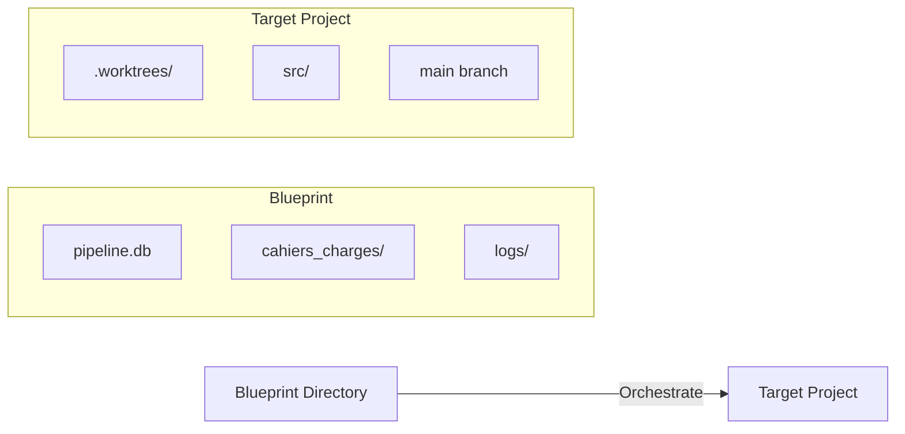
```mermaid
graph LR
    A[Blueprint Directory] -->|Orchestrate| B[Target Project]

    subgraph Blueprint
        A1[pipeline.db]
        A2[cahiers_charges/]
        A3[logs/]
    end

    subgraph "Target Project"
        B1[.worktrees/]
        B2[src/]
        B3[main branch]
    end
```

**Exemples**:
```bash
# Travailler sur un projet externe
python orchestrator/main.py start "requirement" --project /path/to/my-app

# Configurer un projet par défaut
# config/pipeline_config.yaml:
#   general:
#     default_target_project: /path/to/my-app

# Puis :
python orchestrator/main.py start "requirement"  # Utilise le projet par défaut
```

### 🧹 Système de Nettoyage Phase-Aware

**Nouveau**: Nettoyage intelligent qui distingue documents de planification et code réel

**Avant (< v2.0)**: Nettoyage manuel ou risqué
**Après (v2.0)**: Cleanup automatique basé sur la phase d'échec

**Bénéfices**:
- ✅ Protection du code : ne supprime jamais le code par erreur
- ✅ Nettoyage automatique : cleanup auto en cas d'échec
- ✅ Modes flexibles : standard, dry-run, force

**Nouvelle commande**:
```bash
# Nettoyage standard (sécurisé)
python orchestrator/main.py cleanup --project /path/to/mon-projet

# Aperçu sans suppression
python orchestrator/main.py cleanup --project /path/to/mon-projet --dry-run

# Nettoyage forcé (tout supprimer)
python orchestrator/main.py cleanup --project /path/to/mon-projet --force
```

**Logic Phase-Aware**:
- Échec Phase 0/0.5/1 → Cleanup complet (aucun code généré)
- Échec Phase 2/3/4 → Cleanup cahiers seulement (protège le code)

**Ce qui est nettoyé**:

| Mode | Cahiers | Worktrees vides | Worktrees avec code | DB |
|------|---------|----------------|-------------------|-----|
| Standard | ✅ | ✅ | ❌ Protégé | Conservé |
| Force | ✅ | ✅ | ✅ Supprimé | Partiel |
| Auto | ✅ | ✅ | Phase-aware | Conservé |

**Avant (v1.x)**: Access control seulement dans les prompts (suggestion)
**Après (v2.0)**: Access control stocké en DB, trackable, auditable

**Bénéfices**:
- ✅ Traçabilité complète des restrictions par agent
- ✅ Merge automatique des configs (template + spec + defaults)
- ✅ Prêt pour enforcement programmatique futur
- ✅ Agents QA créés automatiquement avec restrictions appropriées

**Nouvelles colonnes dans `agents`**:
- `allow_paths` : JSON array des patterns autorisés
- `exclude_paths` : JSON array des patterns exclus
- `access_mode` : Mode d'enforcement ('block', 'log', 'ask')
- `worktree_path` : Chemin du worktree pour validation contexte

---

## 🔄 Migration depuis v1.x

Si vous utilisez une version `< 2.0.0` :

### Étape 1 : Sauvegarder

```bash
# Sauvegarder l'ancienne DB
cp pipeline.db pipeline.db.v1.backup

# Sauvegarder les specs (si précieuses)
cp -r specs/ specs.v1.backup/
```

### Étape 2 : Réinitialiser

```bash
# Supprimer l'ancienne DB
rm pipeline.db

# Créer la nouvelle DB avec les nouvelles tables
python orchestrator/main.py init
```

### Étape 3 : Mettre à jour la Config

```yaml
# config/pipeline_config.yaml

# AJOUTER ces sections
phase0:
  enabled: true
  max_parallel_analysts: 5
  enable_gemini_research: false
  cahiers_charges_dir: "cahiers_charges"

phase2:
  inject_cahier_as_context: true

phase4:  # Ancien phase5
  on_conflict: "prompt_user"
  create_conflict_report: true
```

### Étape 4 : Tester

```bash
# Test Phase 0 seule
python orchestrator/main.py run-phase 0 --requirement "Test migration"

# Vérifier les cahiers générés
ls cahiers_charges/

# Tester le pipeline complet
python orchestrator/main.py start "Test complet v2.0"
```

### Changements Majeurs

| v1.x | v2.0 | Impact |
|------|------|--------|
| 6 phases | 5 phases | Phase 0 consolidée |
| Specs JSON | Cahiers Markdown | Format plus riche |
| Phase 4 (QA) | Phase 3 (QA) | Renumérotation |
| Phase 5 (Merger) | Phase 4 (Merger) | Renumérotation |
| Auto-résolution conflits | Supprimée | Plus sécurisé |
| Pas de retry | Retry loop (3x) | Auto-correction |
| Gemini API | Gemini CLI | Plus flexible, pas de gestion de clés |

**⚠️ IMPORTANT** : Les tâches en cours dans v1.x seront perdues. Terminez-les avant migration.

---

## 🔍 Troubleshooting

### Erreur : "Not a git repository"

**Symptôme** :
```
fatal: not a git repository (or any of the parent directories): .git
```

**Solution** :
```bash
# Initialiser Git
git init

# Créer un commit initial
git add .
git commit -m "Initial commit"
```

---

### Erreur : "Agent template not found in WSL"

**Symptôme** :
```
FileNotFoundError: Template 'senior-engineer' not found in ~/.claude/agents/
```

**Solution** :
```bash
# Vérifier que WSL est démarré
wsl --status

# Vérifier l'existence des templates
wsl ls ~/.claude/agents/

# Si le dossier n'existe pas, créer les templates
wsl mkdir -p ~/.claude/agents/
# Puis copier vos templates dans ce dossier
```

---

### Erreur : "Database locked"

**Symptôme** :
```
sqlite3.OperationalError: database is locked
```

**Solution** :
```bash
# Une autre instance du pipeline tourne
# Trouver le processus
ps aux | grep "python.*main.py"

# Tuer le processus
kill <PID>

# Ou attendre qu'il se termine
```

---

### Erreur : "Worktree already exists"

**Symptôme** :
```
fatal: '.worktrees/TASK-101' already exists
```

**Solution** :
```bash
# Lister les worktrees
git worktree list

# Supprimer le worktree
git worktree remove .worktrees/TASK-101

# Ou forcer la suppression
git worktree remove --force .worktrees/TASK-101
```

---

### Problème : Phase 3 échoue toujours

**Symptôme** : Toutes les validations échouent

**Solutions** :

1. **Vérifier les test commands** :
```yaml
phase3:
  tester:
    test_commands:
      - "npm test"  # ⚠️ Vérifier que cette commande existe
      - "npm run lint"
```

2. **Désactiver temporairement** :
```yaml
phase3:
  verifier:
    enabled: false  # Désactiver verifier
  tester:
    enabled: true   # Garder seulement tester
```

3. **Mode debug** :
```yaml
general:
  log_level: "DEBUG"  # Logs détaillés
development:
  verbose_logging: true
```

---

### Problème : Conflits Git fréquents

**Symptôme** : Beaucoup de `MERGE_CONFLICT`

**Solutions** :

1. **Merge plus fréquent** : Ne pas accumuler trop de tâches avant merge

2. **Vérifier les dépendances** :
```json
{
  "task_id": "TASK-202",
  "dependencies": ["TASK-201"]  // Dépendance explicite
}
```

3. **Désactiver batch merge** :
```yaml
phase4:
  batch_merge_enabled: false  # Merge une par une
```

---

### Erreur : "Target project must be specified"

**Symptôme** :
```
Error: Target project must be specified. Use --project or set default_target_project in config
```

**Solutions** :

1. **Spécifier le projet via CLI** :
```bash
python orchestrator/main.py start "requirement" --project /path/to/mon-projet
```

2. **Configurer un projet par défaut** :
```yaml
# config/pipeline_config.yaml
general:
  default_target_project: "/path/to/mon-projet"
```

3. **Pour travailler sur Blueprint lui-même** :
```bash
python orchestrator/main.py start "requirement" --project .
```

---

### Problème : Worktrees persistent après cleanup

**Symptôme** : Les worktrees restent même après `cleanup`

**Explication** : Par défaut, Blueprint **protège le code** généré. Les worktrees avec commits ne sont jamais supprimés en mode standard.

**Solutions** :

1. **Vérifier si les worktrees ont du code** :
```bash
# Dans le projet cible
cd /path/to/mon-projet
git worktree list
cd .worktrees/TASK-101
git log --oneline
```

2. **Forcer la suppression (DANGEREUX)** :
```bash
# ⚠️ Supprime TOUT, y compris le code
python orchestrator/main.py cleanup --project /path/to/mon-projet --force
```

3. **Suppression manuelle sélective** :
```bash
cd /path/to/mon-projet
git worktree remove .worktrees/TASK-101
```

---

### Question : Pourquoi le nettoyage automatique ne supprime pas tout ?

**Comportement Phase-Aware** :
- **Échec Phase 0/0.5/1** : Supprime tout (aucun code généré)
- **Échec Phase 2/3/4** : Garde le code, supprime seulement les cahiers

**Principe** : "Tout ce qui n'a pas eu d'impact réel sur le code peut être supprimé sans demander"

**Exemple** :
```python
# Logique interne de Blueprint
if failed_phase in ['phase0', 'phase0_5', 'phase1']:
    await self._cleanup_all_temp_files()  # Aucun code existe
else:
    await self._cleanup_cahiers_only()    # Protège le code
```

---

### Erreur : "Branch 'main' not found"

**Symptôme** :
```
Error: pathspec 'main' did not match any file(s) known to git
```

**Cause** : Votre projet utilise `master` au lieu de `main`

**Solutions** :

1. **Mettre à jour la configuration** :
```yaml
# config/pipeline_config.yaml
git:
  base_branch: "master"  # Au lieu de "main"
```

2. **Vérifier la branche actuelle** :
```bash
cd /path/to/mon-projet
git branch
# Si vous voyez "* master", utilisez "master" dans la config
```

---

### Problème : Gemini CLI ne fonctionne pas

**Symptôme** :
```
Warning: Gemini CLI not found. Skipping research.
```

**Solutions** :

1. **Installer Gemini CLI** :
```bash
# Windows
npm install -g @google/gemini-cli

# WSL/Linux
wsl npm install -g @google/gemini-cli
```

2. **Authentification** :
```bash
# Login OAuth (recommandé)
gemini auth login

# Ou via API key
export GEMINI_API_KEY="votre-clé-api"
```

3. **Test** :
```bash
# Windows
npx.cmd @google/gemini-cli "Test" --output-format json

# WSL
wsl npx @google/gemini-cli "Test" --output-format json
```

4. **Désactiver si non nécessaire** :
```yaml
phase0:
  enable_gemini_research: false
```

---

### Erreur : ModuleNotFoundError sous WSL

**Symptôme** :
```
ModuleNotFoundError: No module named 'httpx'
```

**Solution** :
```bash
# Installer les packages Python dans WSL
wsl pip install --break-system-packages httpx
wsl pip install --break-system-packages -r requirements.txt
```

---

## ❓ FAQ

### Q1 : Puis-je utiliser Blueprint en production ?

**R** : ⚠️ **Pas encore**. La version actuelle utilise des **simulations** (`_simulate_*()` functions). Pour la production :
1. Remplacer les simulations par de vrais appels IA (ex: Anthropic API)
2. Tester extensivement sur des projets réels
3. Implémenter le monitoring et les alertes

---

### Q2 : Combien de tâches le pipeline peut-il gérer en parallèle ?

**R** : Cela dépend de votre configuration :

```yaml
phase0:
  max_parallel_analysts: 5  # 5 analystes simultanés

phase2:
  max_parallel_specialists: 3  # 3 spécialistes simultanés

phase3:
  parallel_execution: true  # Verifier + Tester en //
```

**Exemple** : Avec `max_parallel_specialists: 3`, si vous avez 9 tâches :
- Batch 1 : TASK-101, TASK-102, TASK-103 (parallèle)
- Batch 2 : TASK-201, TASK-202, TASK-203 (parallèle)
- Batch 3 : TASK-301, TASK-302, TASK-303 (parallèle)

---

### Q3 : Que se passe-t-il si un agent échoue ?

**R** : Dépend de la phase et de la configuration :

**Phase 0-2** : L'agent échoue, la tâche reste dans son statut actuel
**Phase 3** : Boucle de retry (max 3 fois) avec feedback injecté
**Phase 4** : Si conflit → `git merge --abort`, rapport créé

```yaml
error_handling:
  max_retries: 3
  on_validation_failure:
    action: "retry"  # ou "skip", "abort"
```

---

### Q4 : Puis-je ajouter mes propres templates d'agents ?

**R** : ✅ **Oui** !

1. Créer le template dans WSL :
```bash
wsl nano ~/.claude/agents/custom-agent.md
```

2. Ajouter dans la config :
```yaml
agents:
  role_mapping:
    custom_role: "custom-agent"
```

3. Utiliser :
```yaml
phase2:
  specialist_template: "custom-agent"
```

---

### Q5 : Comment désactiver Gemini Research ?

**R** : Par défaut, Gemini CLI est désactivé. La configuration :

```yaml
phase0:
  enable_gemini_research: false  # Déjà false par défaut

gemini:
  enabled: false  # Déjà false par défaut
  use_cli: true  # Utilise Gemini CLI au lieu de l'API
```

**Note** : Gemini CLI doit être configuré séparément. Voir [`docs/GEMINI_CLI_SETUP.md`](docs/GEMINI_CLI_SETUP.md) pour l'installation et l'authentification.

---

### Q6 : Puis-je utiliser un autre modèle que Gemini pour la recherche ?

**R** : Gemini CLI supporte plusieurs modèles :
- `gemini-2.5-pro` : Plus puissant, contexte 1M tokens
- `gemini-2.5-flash` : Plus rapide pour les requêtes simples

Pour utiliser un autre outil CLI (ex: Claude, GPT-4) :

1. Créer `orchestrator/agents/custom_researcher.py`
2. Implémenter la même interface que `GeminiResearcher`
3. Adapter la méthode `_call_cli()` pour votre outil CLI
4. Modifier `phase0_master_analysts.py` pour utiliser votre classe

---

### Q7 : Quelle est la différence entre Phase 0 et Phase 0.5 ?

**R** : Les deux phases ont des rôles complémentaires mais distincts :

| Phase 0 | Phase 0.5 |
|---------|-----------|
| 🧠 **Génère** les cahiers des charges | 🌟 **Enrichit** les cahiers existants |
| ⚡ Analyse métier et technique | 📚 Recherche bonnes pratiques 2025 |
| 🎯 Obligatoire | 🔄 Optionnel (si Gemini activé) |
| Parallèle (plusieurs analysts) | Séquentiel (évite rate limits) |
| **Output**: Cahiers bruts | **Output**: Cahiers enrichis |

**Quand utiliser Phase 0.5** :
- ✅ Vous voulez du contexte réel et moderne dans les cahiers
- ✅ Gemini CLI est configuré et authentifié
- ✅ Vous avez besoin de recommandations professionnelles actuelles
- ✅ Le projet nécessite les meilleures pratiques de l'industrie

**Quand ne PAS utiliser Phase 0.5** :
- ❌ Vous voulez une génération rapide sans recherche
- ❌ Gemini n'est pas configuré
- ❌ Le projet est simple et ne nécessite pas de recherche approfondie
- ❌ Vous avez des contraintes de temps strictes

**Configuration** :
```yaml
phase0_5:
  enabled: true  # false par défaut
  enrichment_types:
    good_practices: true     # Standards actuels
    modern_approaches: true  # Technologies 2025
    real_world_context: true # Retours d'expérience
```

---

### Q8 : Quelle est la différence entre "analyst" et "specialist" ?

| Analyst (Phase 0) | Specialist (Phase 2) |
|-------------------|---------------------|
| 📋 Crée des cahiers des charges | 💻 Implémente le code |
| 🔍 Effectue de la recherche | 🎯 Suit les recommandations du cahier |
| 🧠 Vision macro (domaine) | 🔬 Vision micro (tâche) |
| **Output** : Markdown | **Output** : Code |

---

### Q9 : Comment gérer les secrets (API keys) ?

**R** : ✅ **Variables d'environnement** (recommandé) :

```bash
# .env (ne PAS commit)
GEMINI_API_KEY="votre-clé"

# Charger dans le code
import os
api_key = os.getenv("GEMINI_API_KEY")
```

❌ **Ne JAMAIS** mettre les clés directement dans `pipeline_config.yaml` si vous commitez ce fichier.

---

### Q10 : Puis-je utiliser Blueprint avec d'autres langages que JavaScript/Python ?

**R** : ✅ **Oui** ! Blueprint est agnostique du langage. Configurez simplement :

```yaml
phase3:
  tester:
    test_commands:
      - "cargo test"        # Rust
      - "go test ./..."     # Go
      - "mvn test"          # Java
      - "dotnet test"       # C#
```

---

### Q11 : Combien de temps prend une exécution complète du pipeline ?

**R** : Dépend de :
- Nombre de domaines identifiés
- Nombre de tâches par domaine
- Parallélisation configurée
- Complexité du code

**Exemple** : Requête "Améliorer la sécurité"
- Phase 0 : ~5 min (3 domaines, 9 tâches)
- Phase 1 : ~1 min (créer 9 worktrees)
- Phase 2 : ~15 min (3 spécialistes en //, 3 batches)
- Phase 3 : ~10 min (validations parallèles)
- Phase 4 : ~5 min (merge séquentiel)
- **Total** : ~36 min

---

## 🗺️ Roadmap

### v2.1 (Q1 2025)

- [ ] **Intégration Anthropic API** : Remplacer simulations par vrais appels Claude
- [ ] **Interface Web de Monitoring** : Dashboard temps réel du pipeline
- [ ] **Metrics & Analytics** : Tracking performance, taux de succès

### v2.2 (Q2 2025)

- [ ] **Multi-repos Support** : Gérer plusieurs repos simultanément
- [ ] **GitHub Actions CI/CD** : Intégration continue
- [ ] **Auto-rollback** : Rollback automatique si merge échoue en prod

### v3.0 (Q3 2025)

- [ ] **Claude Code CLI Integration** : Utiliser subagents natifs `.claude/agents/`
- [ ] **Template Marketplace** : Partager des templates d'agents
- [ ] **Distributed Execution** : Pipeline distribué sur plusieurs machines

### Backlog

- [ ] Tests unitaires complets (pytest)
- [ ] Support multi-langages (TypeScript, Go, Rust)
- [ ] Plugin system pour extensibilité
- [ ] Webhooks pour notifications externes
- [ ] Code review automatique avec Claude

---

## 🤝 Contributing

Blueprint est un projet **expérimental** d'architecture générative d'agents. Les contributions sont bienvenues !

### Comment Contribuer

1. **Fork** le projet
2. **Créer une branche** : `git checkout -b feature/amazing-feature`
3. **Commit** : `git commit -m "feat: add amazing feature"`
4. **Push** : `git push origin feature/amazing-feature`
5. **Ouvrir une Pull Request**

### Domaines de Contribution

- 🧠 **Amélioration des prompts** : Rendre les agents plus efficaces
- 📝 **Nouveaux templates** : Ajouter des spécialités (DevOps, ML, etc.)
- ⚡ **Optimisation** : Améliorer la parallélisation
- 🛡️ **Sécurité** : Renforcer la gestion de conflits et access control
- 📚 **Documentation** : Améliorer ce README, ajouter des guides

### Code Style

- Python : PEP 8
- Docstrings : Google style
- Type hints obligatoires
- Tests pour toute nouvelle feature

---

## 📜 License

**Educational & Research Use Only**

Ce projet est fourni "tel quel" à des fins **éducatives et de recherche**. Il s'agit d'un système expérimental d'orchestration d'agents IA.

⚠️ **Limitations** :
- Pas de garantie de fonctionnement en production
- Simulations uniquement (pas de vrais appels IA)
- Utiliser à vos propres risques

Pour une utilisation commerciale ou en production, contactez l'auteur.

---

## 👤 Auteur

**Système d'Architecture Générative d'Agents**

📧 Contact : [votre-email]
🐙 GitHub : [votre-github]

---

## 🙏 Remerciements

- **Anthropic** : Pour Claude et le Claude Code CLI
- **Google** : Pour Gemini CLI
- **La communauté open-source** : Pour les outils et bibliothèques utilisés

---

<div align="center">

**⭐ Si ce projet vous est utile, n'hésitez pas à lui donner une étoile ! ⭐**

[](https://github.com/yourusername/blueprint)

---

**Blueprint v2.0** - *Transformez vos idées en code, automatiquement.*

</div>
